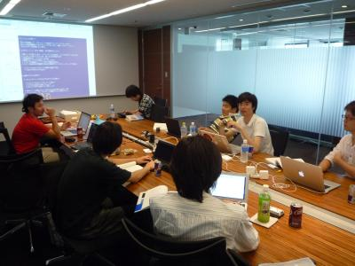

=====================================
 第五回 併設イベントの紹介 (9/7締め)
=====================================

内容が多くなるようであれば二回に分けます。
内容としては各コミュニティの紹介とやることを予定

挨拶 (ほさか)
=============

併設イベントを立てた理由 (寺田)
===============================

App Engine Conference 2012
==========================

.. image:: /_static/logo_appengine.*

Google App Engineの紹介
-----------------------

`Google App Engine`_ は Google が提供する、優れた自動スケーリング機能を持つ Web アプリケーションプラットフォームです。App Engine を使うことにより、開発者はインフラストラクチャーの管理をすることなしに、アプリケーションの開発に専念することができるようになります。

2008 年 4 月にプレビューとしてリリースされてから 4 年の間に順調に成長し、現在では 100 万のアクティブなアプリケーションをホストし、1 日に 75 億の Web リクエストを、また月に 2 兆回のデータストアオペレーションを処理するまでになりました。去年の終わりから SLA やプレミアサポートなど、ビジネスでも安心して使えるような体制が整い、さらなる発展が見込まれています。

Google App Engine コミュニティの紹介
------------------------------------

日本の App Engine コミュニティ(ハッシュタグ #gaeja)は世界的にみても非常に活発で、不定期ですが頻繁に App Engine ja Night というイベントが開催されています。イベントの告知は各種ソーシャルメディアの #gaeja などで行われています。また `Google App Engine Japan グループ`_ では日本語で情報交換を行ったり、コミュニティや Google 社員からのサポートが受けられます。

.. _`Google App Engine`: https://developers.google.com/appengine/
.. _`Google App Engine Japan グループ`: http://groups.google.com/group/google-app-engine-japan/

App Engine Conference 2012
--------------------------

`App Engine Conference 2012`_ は 9 月 15 日と 17 日の開催です。15 日には App Engine Python 版の新機能についてのセッションを中心として、実際のユーザーの声が聞けるパネルディスカッションのコーナーや、またコミュニティハングアウトと称して、App Engine に関心のある人が集まって懇親できる場も用意しました。17 日の Sprint では、App Engine Python2.7 を使用したハンズオン形式のコードラボを実施予定です。

プログラム詳細については `App Engine Conference 2012`_ イベントページで確認できます。

.. _`App Engine Conference 2012`: https://sites.google.com/site/appengineconference2012/

Django & Pyramid Con JP 2012 (hirokiky or aodag)
================================================

.. image:: /_static/logo_django.*

.. image:: /_static/logo_pylons.*

SphinxCon JP 2012 (小宮 & 清水川)
====================================

.. image:: /_static/SphinxConJP2012-logo.png

著者: 小宮(Sphinx-Users.jp 会長), 清水川(Sphinx-Users.jp 副会長)

Sphinxの紹介
-------------

「 Sphinx_ （スフィンクス）」は、Wikiに似たマークアップによる効率良い記述と、HTML, ePub, PDFなど多くのフォーマットによる出力が可能なオープンソースのドキュメントツールで、美しいドキュメントを簡単に生成することができます。サイトの構築や電子書籍の作成、仕事の納品物の作成はもちろん、作りっぱなしではなく、コードや業務と一体になって共に成長するドキュメント作成のプロセスをサポートしてくれます。

多くのオープンソースのドキュメントや、コミュニティーサイト、2010年から2012年にかけて出版された「 `つまみぐい勉強法`_ 」「 `エキスパートPythonプログラミング`_ 」「 `Pythonプロフェッショナルプログラミング`_ 」等の執筆で使用されています。

.. _Sphinx: http://sphinx.pocoo.org/
.. _`つまみぐい勉強法`: http://www.amazon.co.jp/dp/477414259X
.. _`エキスパートPythonプログラミング`: http://www.amazon.co.jp/dp/4048686291
.. _`Pythonプロフェッショナルプログラミング`: http://www.amazon.co.jp/dp/4798032948
.. _`Sphinx-Users.jp`: http://sphinx-users.jp/

Sphinx-users.jp ユーザーグループの紹介
----------------------------------------

`Sphinx-Users.jp`_ (略称#sphinxjp)は、Sphinxの普及を主眼としたコミュニティです。このSphinx-Users.jpのサイトもSphinxを使って作られています。

日本で散らばっているSphinx関連情報を集めて、Webサイト、イベントを通じてSphinx情報を発信します。また、 `メーリングリスト`_ での情報交換、 `勉強会`_ の開催などを通じて、ドキュメントをパワーアップしたい人、ドキュメントや翻訳で苦労している人、Sphinxの拡張機能を開発したい開発者たちに ”Fun” を提供していきます。

月1回、ユーザー会主催でSphinx+翻訳 Hack-a-thonというイベントを開催しています。このイベントではSphinx をいじってみたり、翻訳をおこなったりします。hack-a-thonは講習会ではないので自分で行動しないといけませんが、Sphinxを普段使う人が集まるため、 初めて参加する人がツールの雰囲気やtipsを知るために質問するのに良い場だと思います。

   Sphinx+翻訳 Hack-a-thon の様子

また、オープンソースカンファレンスなどのイベントへの参加も行っています。
イベントの活動履歴については `勉強会`_ をご参照ください。

.. _`メーリングリスト`: http://sphinx-users.jp/howtojoin.html#mailinglist
.. _`勉強会`: http://sphinx-users.jp/event/index.html

SphinxCon JP 2012 発表の概要
------------------------------

`SphinxCon JP 2012`_ では、これから Sphinx を始める人のためのセッション「Sphinx ではじめるドキュメント生活 2012」からはじまり、一歩すすんだ Sphinx の使い方である Sphinx 拡張やテーマ、ドキュメント管理・構築の自動化について、そして業務での利用事例など、Sphinx に関するセッションを聞くことができます。これから Sphinx を使ってみようという初心者の方から、既にドキュメントづくりに Sphinx を利用されている中級者・上級者に至るまで、どなたでも参加できるイベントです。
 ソフトウェアを作っていく上でかならず必要になる「ドキュメント」について、もっと便利に・簡単にドキュメントを作って見ませんか？

発表の詳細・タイムテーブルは `SphinxCon JP 2012`_ イベントページにて公開しております。また、3日目(9/17)の Sprint Day では Sphinx ハンズオンを開催しますので、興味のある方は是非ご参加ください。

.. _`SphinxCon JP 2012`: http://sphinx-users.jp/event/20120916_sphinxconjp/index.html

NVDA Workshop in Japan (西本)
=============================

.. image:: /_static/logo_nvda.*

著者: 西本(NVDA日本語チーム 代表)

NVDAの紹介
-------------

`NonVisual Desktop Access (NVDA) <http://www.nvda-project.org/>`_ は視覚に障害のある人がコンピューターを使うための支援技術のひとつで、スクリーンリーダーと呼ばれているソフトウェアです。
名前が示すように、画面に表示される情報を合成音声で読み上げることが基本機能です。
NVDA は Python と C++ で実装されたオープンソースソフトウェアで、 Windows に対応しています。ライセンスはGPL v2です。

NVDA の主要な開発者は、視覚障害の当事者でもあるオーストラリア在住の Michael Curran さんと James Teh さんです。
オープンソース開発を支援するサイトである sourceforge.net は
`Project of the Month, March 2011 <http://sourceforge.net/blog/potm-201103/>`_ として NVDA
を取り上げました。
一般に、スクリーンリーダーは高価なソフトウェアですが、NVDAの開発者は「世界中の視覚障害を持つ人が、晴眼者と同じコストでコンピューターを利用できるようにしたい。政府や福祉団体に要求をするだけでなく、開発者の立場だからできることもある」と考えたようです。
Linux デスクトップでは GNOME Orca というオープンソースのスクリーンリーダーが実現されています。
彼らはオープンソースの Windows 対応スクリーンリーダーの開発言語に Python を選びました。

NVDA の最初のリリースは2006年でした。
以来、アクセシビリティに積極的な企業や団体の支援を受けて、
NVDA は高価な商用のスクリーンリーダに匹敵するソフトウェアに成長しました。
`2012年5月の調査 <http://webaim.org/projects/screenreadersurvey4/>`_ では NVDA をよく使っていると回答したユーザーが 43% にのぼっています。
NVDA の国際化は翻訳ボランティアが行っており、現在は約40の言語に対応しています。

ユーザーの立場から見た NVDA の魅力のひとつは「コミュニティのスピード」です。
NVDA は1年に3回バージョンアップし、 `WAI-ARIA <http://www.w3.org/WAI/intro/aria.php>`_ や `PDF/UA <http://pdf.editme.com/PDFUA>`_ などのアクセシビリティ標準規格を支援しています。
Windows 8 やタブレット操作への対応も進んでいます。
この開発体制を維持するために、非営利組織 `NV Access <http://www.nvaccess.org/>`_ は、企業や公的機関に資金援助を求めるだけでなく、ユーザーにも `寄付の呼びかけ <http://www.nvaccess.org/blog/NVDANeedsYou>`_ を行っています。

日本では `NVDA日本語チーム`_ が、日本語の音声合成やかな漢字変換の読み上げ機能を追加した `派生版(nvdajp) <http://sourceforge.jp/projects/nvdajp/releases/>`_ をリリースしています。点字ディスプレイとよばれる装置に日本語の点字を出力する作業にも取り組んでいます。

日本では、視覚障害を持つ人は、自治体の補助などを利用して商用のスクリーンリーダを購入することが多く、オープンソースのスクリーンリーダーへの関心は高くありません。
しかし、海外でシェアを高めつつあるオープンソースのスクリーンリーダーが、日本でひろく使われる状態になることは、スクリーンリーダーに配慮した Web サイトやアプリケーションを開発する日本の開発者にとっても、意味のあることです。

NVDA Workshop in Japan 発表の概要
----------------------------------------------------

2012年5月に NV Access は、 `Taiwan Digital Talking Books Association <http://www.tdtb.org/english/index.html>`_ などと協力して `中国語対応を強化するという発表 <http://www.nvaccess.org/blog/AJointEffortToImproveNVDAForChineseLanguageUsers>`_ を行いました。

今回 NVDA Workshop in Japan では、オーストラリアから NVDA の主要な開発者 Michael Curran さんを、台湾から Jerry Wang さんと Aaron Wu さんをお招きして、中国語を含む東アジア言語への対応についてお話を伺います。
日本からは西本がNVDAの日本語対応の現状と課題をご報告します。
最後に DAISY コンソーシアム 前代表の 河村 宏 さんに「グローバルなオープンスタンダード技術によるインクルーシブな社会発展」と題して講演していただきます。

東アジア言語圏のテキストに関する技術資料はあまり英語に翻訳されていません。
`CJKV Information Processing, 2nd Edition (By Ken Lunde) <http://shop.oreilly.com/product/9780596514471.do>`_ のような書籍はありますが、音声合成、点字、スクリーンリーダーなど、アクセシビリティに関わる技術者の国際的な交流は、日本が世界に取り残されないために必要です。
アクセシビリティに関する東アジア言語圏の技術情報を海外に伝えていくことは、Windows 以外の OS やデバイスのアクセシビリティを強化していくためにも有用と思います。
このワークショップを、その足がかりにしたいと考えています。

.. _`NVDA日本語チーム`: http://www.nvda.jp/
.. _`NVDA Workshop in Japan`: http://workshop.nvda.jp/about

最後まとめ (ほさか)
===================

