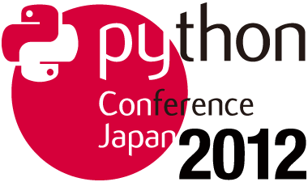

===============================================
 PyCon JP レポート番外編 - PyCon Taiwan 出張 -
===============================================

.. figure:: _static/pycontw_logo.*
   :width: 480px

PyCon JP 2012 広報担当の保坂です。

去る6月9日(土), 10日(日) に台湾の `中央研究院 人文社會科學館 <http://hssb.committee.sinica.edu.tw/>`_ にて PyCon Taiwan が開催されました。
筆者は PyCon JP のメンバーとしてこれに参加し、 PyCon JP の宣伝を行うなどしてきました。
ここでは PyCon JP レポート番外編として PyCon Taiwan 出張レポートをお届けします。

今回の出張の目的について
========================

昨年開催した PyCon JP 2011 では、台湾から二名 (`Sinker`_, `Hychen`_) が参加し、セッションスピーカーとして発表してくれました。
そこで今回 PyCon Taiwan 2012 に PyCon JP 代表として有志が参加し、日台間の Pythonista のより活発な交流がなされるようになれば、と筆者含め8名が参加してまいりました。

交流に加え、今年開催する PyCon JP 2012 の紹介をする時間を PyCon Taiwan 運営チームから頂けたので、 PyCon JP 2012 の宣伝をするという目的もあります。

PyCon Taiwan について
=====================

PyCon Taiwan は PyCon JP や世界各地で開催されている PyCon と同様に Python プログラマが一堂に会し、技術情報の交換や、交流を広げるための場として開催されました。

開催概要を以下に示します。

.. list-table::
   
   - * 開催期間
     * 6/9(土), 10(日)
   - * 開催場所
     * `台湾中央研究院 (Academia Sinica) <http://www.sinica.edu.tw/>`_
   - * URL
     * http://pycon.tw/
   - * 参加者数
     * 250強
   - * トラック数
     * 1
   - * セッション数
     * 基調講演 2, セッション18 (LT等を除く)

二日開催であったりトラック数が1であるなどの違いはありますが、規模としては前回の PyCon JP 2011 と同程度でしょうか。

.. figure:: _static/pycontw-poster.jpg
   :width: 640px

.. todo::

   参加者数・セッション数を埋める
   会についての説明

日本からの参加者
----------------

今回の PyCon Taiwan は、筆者以外にも下の八人が参加しました。
筆者が海外渡航は初めてだったこともあり、以下のメンバーとの旅となったことはとても心強いものでした。

.. list-table::
   :header-rows: 1

   - * 名前
     * Twitter ID
     * 備考
     
   - * 寺田
     * `@terapyon`_
     * PyCon JP 2012 座長
   - * 清水川
     * `@shimizukawa`_
     * PyCon JP 2012 副座長
   - * 鈴木たかのり
     * `@takanory`_
     * PyCon JP 2012 スポンサー担当
   - * もりもと
     * `@t2y`_
     * \-
   - * 池
     * `@rokujyouhitoma`_
     * \-
   - * 村岡
     * `@jbking`_
     * \-
   - * 西本
     * `@24motz`_
     * NVDA 日本語チーム代表
   - * (文殊堂)
     * `@monjudoh`_
     * (PyCon Taiwan は参加せず)

.. figure:: _static/start-members.jpg
   :width: 640px

   羽田空港ロビーでの出発前のメンバーの様子(一部)

出張スケジュール
================

ここで、簡単にどのようなスケジュールで台湾を訪問したかを記します。
大体以下のようなスケジュールで行動しました。

.. list-table::
   :header-rows: 1

   - * 時刻
     * 内容
   - * 8日早朝
     * 羽田発
   - * 11時過ぎ
     * 台北着
   - * 13:30
     * Mozilla Taiwan 訪問
   - * 夜まで
     * 観光
   - * 9日
     * PyCon Taiwan 参加
   - * 10日
     * PyCon Taiwan 参加
   - * 昼食前
     * 登壇して PyCon JP 宣伝
   - * 昼食後
     * 観光の後日本へ

一日目: 6/8(金)
===============

一日目は朝6時に羽田空港国際線ターミナル集合、7時30分発の飛行機で台湾に飛ぶというスケジュールでした。
フライト時間はおよそ三時間半です。台湾のタイムゾーンは GMT+8 (日本は GMT+9) であるため、台湾の現地時間で 10時過ぎに到着しました。

空港で諸々の手続きを済ませ、一日目のホテルである `中源大飯店`_ に荷物を預け、昼食を取った後に Mozilla Taiwan に向かいました。

Mozilla Taiwan 訪問
-------------------

13:30過ぎに(台北101近く) Mozilla Taiwan を訪問しました。

Mozilla Taiwan では Mr.Boss こと `Bob Chao`_ 氏に迎えられました。
`Bob Chao`_ 氏は座長である寺田さんの知り合いということで、今回 Mozilla Taiwan を訪問することになりました。

Mozilla Taiwan では、 `Bob Chao`_ 氏との歓談の予定だったのですが、ここで一つサプライズがありました。
昨年の PyCon JP 2011 に参加した `Sinker`_ 氏がオフィスにいたのです。 `Sinker`_ 氏は PyCon JP 2011 の数ヶ月後に Mozilla Taiwan に転職したということでした。
Mozilla Taiwan が設立されたのは 2011年10月ですので、(`Wikipedia <http://en.wikipedia.org/wiki/Mozilla_Taiwan>`_ より) 設立直後ということでしょう。

この後 `Bob Chao`_ 氏と `Sinker`_ 氏を交えて自己紹介をし歓談が始まりました。
話の中では Python よりも JavaScript の話が多く(Mozilla ですので)、同行者の中で JavaScript に長けた `@rokujyouhitoma`_ や `@monjudoh`_ などが積極的に話をしていました。

話の中で Mozilla が開発しているモバイルデバイス向け OS である `Boot to Gecko <https://wiki.mozilla.org/B2G>`_ (以下 `B2G`_) を見せてもらえました。
`B2G`_ は既に実機の上で動かせる程度には開発されていて、 Samsung のスマートフォン Galaxy S II の上で動く状態になっていました。
`B2G`_ は近い内に誰でも利用できるような状態で配布されるということでした。
興味のある方は `サイト <https://wiki.mozilla.org/B2G>`_ をチェックしてみるとよいのではないでしょうか。

以上のような話の後に、皆で集合写真を撮影し Mozilla Taiwan を後にしました。

.. figure:: _static/mozilla-taiwan-entrance.jpg
   :width: 640px

   Mozilla Taiwan エントランスにある受付

.. figure:: _static/mozilla-taiwan-javascript.jpg
   :width: 640px

   JavaScript について語り合う `@rokujyouhitoma`_ (中央) と `Bob Chao`_ 氏 (左)

   記念の集合写真
   後列左端が `Sinker`_ 氏
   後列中央右が `Bob Chao`_ 氏

   `B2G`_ を操作している様子

   ブラウザはもちろん `Firefox <http://mozilla.jp/firefox>`_
   

.. todo::

   Bob Chao, Sinker-Li の写真載せる

.. todo::

   最後に集合写真

.. todo::

   B2G の実機写真

`鼎泰豐`_ での夕食
------------------

一日目の夜は Mozilla Taiwan で会った `Bob Chao`_ 氏と `Sinker`_ 氏に加え、PyCon JP 2011 のもう一人の参加者である `Hychen` 氏を加えて `鼎泰豐`_ (Din Tai Fung) 食事を楽しみました。

.. todo::

   もうちょいなんか書こう

.. figure:: _static/dintaifung-sinker.jpg
   :width: 640px

   PyCon JP のフォトブックを見る `Sinker-Li`_ 氏

   `@t2y`_ と語る `Hychen`_ 氏

   会食の様子

.. figure:: _static/dintaifung-food.*
   :width: 480px

   鼎泰豐は小籠包や焼売などがおいしい

二日目: 6/9(土)
===============

PyCon Taiwan 一日目
-------------------

PyCon Taiwan 一日目です。

PyCon Taiwan の会場である `中央研究院`_ は、台湾における最高の学術研究機関です。
`中央研究院`_ の敷地はとても広く、タクシーで会場まで移動したのですが、どの建物で開催されるのかを確認しなかったため、危うく迷うところでした。

会場である人文所國際會議廳(International Conference Hall)にたどり着き、セッションスピーカーとして受付を済ませました。

PyCon Taiwan の会場は、会議場さながらの大変広い会場で、全席電源完備かつ無線LANも飛んでいるなど、カンファレンス参加者としてはとても快適な会場でした。

.. figure:: _static/pycontw-registration.*
   :width: 640px

   受付の様子

.. figure:: _static/pycontw-hall1.*
   :width: 640px

   壇上

.. figure:: _static/pycontw-hall2.*
   :width: 640px

   来場者席

セッション内容
--------------

基調講演は `Travis Oliphant`_ 氏による「Large-scale array-oriented computing with Python」です。
`Travis Oliphant`_ 氏は `NumPy`_ や `SciPy`_ の開発者として知られており、 NumPy や SciPy の高速化の仕組みの説明や、 NumPy のコードを LLVM でコンパイルしてさらに高速に実行する `numba <https://github.com/ContinuumIO/numba>`_ といった技術の紹介をしていました。

この日のセッション内容としては、基調講演の `NumPy`_, `SciPy`_ をはじめ、イベントシミュレーションのためのモジュールである `SimPy <http://simpy.sourceforge.net/>`_, `GIS <http://ja.wikipedia.org/wiki/%E5%9C%B0%E7%90%86%E6%83%85%E5%A0%B1%E3%82%B7%E3%82%B9%E3%83%86%E3%83%A0>`_ (地理情報システム), `NLTK <http://nltk.org/>`_ による自然言語処理, `Matplotlib <http://matplotlib.sourceforge.net/>`_ によるグラフの描画処理など学術的な内容のセッションが多かったように思います。中央研究院という研究機関での開催ということも関係あるのかもしれません。

午前・午後ともにセッションの合間には軽食のための休憩時間が30分設けられ、食事をしながら来場者同士での交流が行われていました。
PyCon JP でもティータイムとして休憩時間を挟むなどしていましたが、立食ではなく学食を使って席がある状態での休憩時間でしたので、特定の人と交流することはできますが、様々な人との交流という意味では立食形式というのもよいのかもしれません。

`プログラムスケジュール <http://tw.pycon.org/2012/program/>`_ を見ていただくとわかるのですが、セッションとセッションの合間に休憩を挟まず、3セッション連続で講演するといったようなスケジュールとなっていました。
これは

- 一つのセッションの時間が30分と短い
- トラック数が一つしかなく、部屋を移動することがない

といった理由によって可能となっていると思います。
三連続セッションの後にティータイムとして30分の休憩を設けているので、各セッション間に10分休憩を挟むのとでトータルの時間は変わりませんが、30分というまとまった時間が休憩時間として存在するというのは、参加者同士が交流する時間を作るという意味では大きいと思います。
このような詰め詰めのスケジュールは、複数トラックが並列して開催され、移動時間が発生する PyCon JP では若干厳しそうです。

セッション内容に関しては、一日目と二日目の基調講演は海外ゲストということで英語での講演でした。
それ以外のセッションに関しては基本的に現地語で発表が行われていたため、我々 PyCon JP 側では若干ついていけない場面もありました。
とはいえ、講演内容はともかくスライドに関しては技術用語はそのまま英語ですし、漢字からニュアンスをなんとなく読み取ることで雰囲気はつかめたと思います。

セッションを聞く傍ら、 skype で日本側メンバーと「このスライドはこんな意味なんじゃない?」とか「前端と後端はフロントエンドとバックエンドって意味じゃないの?」などと推測しあっていたというのも理解の一助になりました。

この日は、最後に LT(Lighting-Talks) のセッションがありました。
セッション内容はスライドを見て理解するだけの時間があったのですが、 LT はさすがにそんな余裕もなく内容を受け取れなかったように思います。

.. figure:: _static/pycontw-keynote1.*
   :width: 640px

   一日目の基調講演者 `Travis Oliphant`_ 氏

.. figure:: _static/pycontw-snack.*
   :width: 480px

   セッションの合間にはお菓子休憩

昼食
----

昼には弁当が用意され、昼食をとるようになっていました。
筆者等は PyCon Taiwan 主催側の計らいにより、「VIP Room」と書かれた部屋で昼食をとらせてもらいました。

「VIP Room」は主催側の一部スタッフとその日のセッションスピーカーのために用意された部屋であるらしく、セッションスピーカーやスタッフとともに昼食の時間を過ごしました。

このような「VIP Room」はスピーカー同士の交流を深めるといった観点で、とても意味のあるものであると思います。
PyCon JP でもこのようなセッションスピーカー向けの部屋というものは用意したほうがいいのではないかと思いました。

昼食後に主催側の人達と話す時間がありました。
その時間で日本から持参したおみやげ(手ぬぐい: Traditional Japanese Towel と紹介しました)を座長である `Yung-Yu Chen`_ 氏に渡したり、翌日の宣伝セッションのために中国語での挨拶の言葉を教えてもらうなどしました。

.. figure:: _static/pycontw-vip-towel.*
   :width: 480px

   お土産の手ぬぐいを受け取って喜ぶ `Yung-Yu Chen`_ 氏

.. figure:: _static/pycontw-vip-teach.*
   :width: 640px

   翌日の発表のために `Yung-Yu Chen`_ 氏に中国語での挨拶を教わる筆者と `@t2y`_

.. figure:: _static/pycontw-vip-takanory.*
   :width: 640px

   一日目の発表者である `Mosky Liu`_ さんを PyCon JP に誘う `@takanory`_

PyCon Taiwan 後
---------------

二日目の宿泊は `中央研究院`_ 内にある宿泊施設です。
二人部屋で一泊 1700 台湾ドル(日本円換算で 4500円くらい)というとてもリーズナブルな価格である割にアメニティなどは一通り揃っているなどかなりお得な感じを受けました。
繁華街にでるのに若干不便ではありますが、そもそも商業用の施設ではないということもあるのでしょうし、値段だけを見れば破格ですのでこれといった不満もありませんでした。

夜は `饒河街観光夜市`_ に向かい、ナイトマーケットで食べ歩き観光を楽しんできました。
ナイトマーケットは商店街のような路地に、屋台がたくさん並んでいる祭りの縁日のような場所です。
食べ物や衣類、おもちゃなどの様々な屋台があり、このような光景が毎晩繰り広げられているのですから大したものです。

.. figure:: _static/nightmarket-gate.*
   :width: 640px

   `饒河街観光夜市`_ の入り口

.. figure:: _static/nightmarket-food.*
   :width: 640px

   名物らしいマンゴーかき氷

.. figure:: _static/nightmarket-food2.*
   :width: 640px

   謎の屋台が並び、縁日のよう

三日目: 6/10(日)
================

PyCon Taiwan 座長へのインタビュー
---------------------------------

PyCon Taiwan の二日目です。

朝食は `中央研究院`_ 内にあるカフェテラスでとりました。
この日は朝食の後に PyCon Taiwan の座長である `Yung-Yu Chen`_ 氏に時間をつくってもらい、インタビューを行いました。

インタビューでは PyCon Taiwan や 台湾における Python コミュニティについての話を聞くことができました。
筆者が印象に残っているのは以下のような内容です。

- PyCon Taiwan はコミュニティのためのコミュニティを目指している
- `中央研究院`_ は台湾のオープンソース関係のカンファレンスを開く際によく使われる
- 台湾にもローカルな Python のコミュニティは存在するが、ツールやライブラリに特化したようなコミュニティはない (日本の例: `sphinx-users.jp <http://sphinx-users.jp/`_)
- `PyJUG <http://www.python.jp/>`_ にあたるような国を代表するようなコミュニティもない
- 台湾の人達は英語が話せるので積極的に開発元の ML などで開発者とコミュニケーションをとるが、その分ローカルなコミュニティが活発ではない。良いことではあるが、悪いところでもある。

PyCon の開催動機としては日本も台湾も基本的に同じようなスタンスのようです。
しかし、コミュニティに関しては国が違えば事情も違うようです。
日本においては英語が堪能な人が少ないために、日本語に特化したローカルなコミュニティが活発です。
しかし、その分メインストリームへのコントリビュートがあまりないという状態ではあるため、良いことと悪いことはトレードオフなのだなと感じます。

最後に日台 PyCon の座長同士で握手を交わし、 PyCon Taiwan 二日目の会場に向かいました。

.. figure:: _static/pycontw-interview-all.*
   :width: 640px

   インタビューの様子

.. figure:: _static/pycontw-interview-yungyu.*
   :width: 480px

   PyCon Taiwan について語る `Yung-Yu Chen`_ 氏

.. figure:: _static/pycontw-interview-handshake.*
   :width: 640px

   握手を交わす日台 PyCon の両座長 `@terapyon`_ (右) と `Yung-Yu Chen`_ 氏(左)

PyCon Taiwan 二日目
-------------------

PyCon Taiwan では、一日目と二日目両方で基調講演を行っていました。
二日目の講演者は、 Web Application Framework の `Django`_ やそのプラグインである `Pinax`_ の開発者である `James Tauber`_ 氏です。
以前は二日目の講演者は `James Tauber`_ 氏ではなかったのですが、開催の二週間前に予定されていた講演者が病気になってしまったということで、急遽二日目の講演者として決定したようです。

講演のタイトルは「Python and the Web」です。
内容としては CGI から始まる Web 開発の歴史を俯瞰するようなもので、最後のほうでは Pylamid/Pylons, flask, Django などの各種フレームワークの紹介といったような感じでした。
広く浅く様々な技術について触れる内容でしたので、基調講演らしい講演だったのではないでしょうか。

二日目のセッション内容としては Python で Web アプリの挙動を記述する `Pyjamas(Pyjs) <http://pyjs.org/>`_ や `Azure <http://www.windowsazure.com/ja-jp/>`_ の上で Python を動かすといったような Web やその周辺の内容が多く、一日目ほど固い内容ではなかったため、わかりやすかったです。

.. figure:: _static/pycontw2-keynote.*
   :width: 640px

   基調講演者 `James Tauber`_ 氏

PyCon JP の宣伝セッション
-------------------------

二日目の昼前、今回のツアーの目的である「PyCon JP の宣伝」のセッションがありました。
筆者はその発表者として PyCon Taiwan に参加していますので、壇上に立ち、発表しました。

発表内容としては

- PyCon JP 2011 の振り返り
- PyCon JP 2012 の紹介
- 会場である `産業技術大学院大学 <http://aiit.ac.jp/>`_ とその周辺の紹介
- お礼

といったようなものです。

英語での発表はもちろん初めてで、このセッションの前までずっと脳内でシミュレーションをするなどしていました。
その甲斐あってか(?) 発表中に狙ったところで笑いを取れたなど、なかなかうまく行ったように思います。

これを機に PyCon JP に台湾からの参加者が増えると良いなと思っています。

スライドは `こちら <http://shomah4a.net/pycontw_slide/>`_ にあります。
また、講演の様子は YouTube に `あげられて <http://www.youtube.com/watch?v=Q1RohyUiAQw>`_ いるようです。

.. figure:: _static/pyconjp-promote-all.*
   :width: 640px

   PyCon JP 宣伝セッション全体

.. figure:: _static/pyconjp-promote-stage.*
   :width: 480px

   PyCon JP ステージ上の筆者   

帰路
----

宣伝セッションの後は一日目同様に VIP Room で昼食をとりました。
朝食後には午後のセッションがあったのですが、帰りの飛行機の時間の関係で午後のセッションには参加できませんでした。
来年また参加するのであればもう少し余裕を持って参加したいと思います。

   PyCon Taiwan パネルの前で記念撮影
   

PyCon Taiwan まとめ
===================

PyCon Taiwan に参加した目的としては

1. 台湾の Pythonista と交流する
2. PyCon JP 2012 の宣伝をする

という二つがありました。

今回は主に PyCon Taiwan 開催側との交流が多く、参加者との交流はあまりありませんでした。
若干残念でしたが、イベントの運営がどのように行われているのかといった話が聞けたことはイベント運営側としては良かったと思います。
次回行くことがあればもう少し英語(というか英会話)の勉強をして、もう少し交流できるようにならないといけないと思いました。

2 の宣伝セッションは、それなりに目立って宣伝できたのかなと思うのですが、上記同様もう少し会話できればさらに宣伝できたのかなと思うと若干残念ではありました。

今回の参加で PyCon Taiwan 運営側の人達にはかなりお世話になりました。
宣伝セッションの時間を頂けただけでなく、中央研究院内のホテルの予約から当日の案内まで相当気を遣っていただけたように思います。
このような姿勢は我々 PyCon JP 運営陣としても見習わなければいけないことだなと思いました。

台湾雑感
========

PyCon Taiwan については以上ですが、今回筆者が台湾に行って感じたことを軽くまとめてみます。
前述したとおり、今回筆者は初めての海外渡航でしたが、台湾はとても楽しかったです。

言語など
--------

初めての海外と言うこともあり、よくわからないことだらけでしたが、渡航するにあたって一番心配だったのが言語でした。

そもそも筆者は英語がうまく話せるわけではありませんし、中国語に関しては全くわかりません。
「謝謝」くらいは言えるとしてもそれだけで意思疎通ができるわけでもありません。

そのような不安はありましたが、台北であればおおよそ英語が通じますし、空港のインフォメーションセンターやホテルのフロントなどはほとんどの場合において日本語が話せる人がいるため、特に困ることもありませんでした。

商店街や夜市にある店に入った際にはおおよその場合において台湾の人だと思われるようで、中国語で話し掛けられたり、会計時に中国語で値段を言われたりしますが、「English OK?」などと訪ねれば大体電卓を出してくれたりします。
なので行動をする上で困ることはないでしょう。

町中にある看板や案内表示などでも漢字+英語でなんとなく意味を推測できるというのは日本人ならではかもしれません。

通信環境
--------

我々開発者にとって水や空気や電気と並んで重要なモバイルネットワークは、空港でプリペイドの SIM カードを購入することで(SIM ロックフリー端末などが必要ですが)即使用可能でした。

そのためネットワーク環境に困ることは全くありませんでした。
プリペイドのSIMカードでネットワークを三日間利用し放題な上に通信速度・通信可能エリアも不満なく快適です。

この環境が250台湾ドル(日本円にしておよそ750円)ですので、とてもお手軽であるといえます。

海外SIMを使える端末が手元にない場合は、台湾でSIMロックフリーな端末を購入してしまうのも良いかもしれません。

.. figure:: _static/sim.*
   :width: 320px
   
   空港で購入した SIM カード
   

食事環境
--------

食事は(若干油分が多いと感じる以外は)特に不満もなく、どれもそれなりにおいしいですし、とても安いです。
夜は台湾名物の夜市(Night Market)に出かけてみると、さながらお祭りの縁日のような光景が毎晩繰り広げられており、とても楽しめるでしょう。

.. figure:: _static/food-foodcoat.*
   :width: 640px

   唯一ハズした台北地下街のフードコートで食べたチャーハンのようなもの

   
.. figure:: _static/food-dintaifung.*
   :width: 640px

   `鼎泰豐`_ (Din Tai Fung) での中華
   中華は外れが少ない印象

.. figure:: _static/food-nightmarket.*
   :width: 640px

   夜市での屋台飯。ジャンクフードにはジャンクフードの良さが
   

交通環境
--------

交通に関してはバス・電車・タクシーなどがありますが、移動に関してあまり難しいことを考えたくない場合はタクシーがオススメです。

3〜4人で乗れば運賃はかなり安いため、今回の旅でも多用しました。行き先の指定に関してはネットワーク環境さえあれば目的地を検索して地名を運転手に見せるのが手っ取り早く確実です。

バス・電車などの公共交通機関を利用する際は Easy Card を購入するとスムーズです。
Easy Card は簡単に言うと Suica/Pasmo などのプリペイド式のカードです。
使い勝手も Suica 等と同様で、電車やパスに乗ったり、コンビニで買い物をするなどの際に利用できます。

最初に  500台湾ドルを払って購入し、デポジット100台湾ドルを除くと残りは400台湾ドルですが、公共交通機関を使うだけであればそんなに使いません。(電車の最低運賃は20台湾ドル、バスの運賃は15台湾ドル)
ですので、おそらくコンビニなどでの買い物で使わない限りは短期の滞在では400台湾ドル分を使い切るのは難しいのではないでしょうか。

.. figure:: _static/easy-card.*
   :width: 480px

   Easy Card

PyCon JP 宣伝
=============

最後になりましたが、ここで `PyCon JP 2012`_ についてのお話です。

9月15, 16, 17 に開催する PyCon JP ですが、六月いっぱい Call for Proposals(CFP) として皆様から発表内容を募集しています。

我こそは! という発表内容をお持ちの方は是非応募して下さい。
「自信がないけれど大丈夫だろうか…」といった方や「初めてなので不安が…」といった方でも、怖じ気付く必要はありません。
折角の機会ですので、是非応募してみてはいかがでしょうか。

CFP の応募は `こちらのフォーム <http://2012.pycon.jp/cfp.html>`_ からお願いします。

皆様の応募をお待ちしております。

.. _`寺田`: http://twitter.com/terapyon
.. _`@terapyon`: http://twitter.com/terapyon
.. _`清水川`: http://twitter.com/shimizukawa
.. _`@shimizukawa`: http://twitter.com/shimizukawa
.. _`鈴木たかのり`: http://twitter.com/takanory
.. _`@takanory`: http://twitter.com/takanory
.. _`もりもと`: http://twitter.com/t2y
.. _`@t2y`: http://twitter.com/t2y
.. _`池`: http://twitter.com/rokujyouhitoma
.. _`@rokujyouhitoma`: http://twitter.com/rokujyouhitoma
.. _`@jbking`: http://twitter.com/jbking
.. _`西本`: http://twitter.com/24motz
.. _`@24motz`: http://twitter.com/24motz
.. _`文殊堂`: http://twitter.com/monjudoh
.. _`@monjudoh`: http://twitter.com/monjudoh

.. _`Sinker`: https://www.facebook.com/profile.php?id=750311951
.. _`Sinker-Li`: https://www.facebook.com/profile.php?id=750311951
.. _`Hychen`: https://www.facebook.com/hychen
.. _`Yung-Yu Chen`: https://www.facebook.com/yungyuc
.. _`Bob Chao`: https://www.facebook.com/bobchao
.. _`Mosky Liu`: https://www.facebook.com/mosky.liu

.. _`B2G`: https://wiki.mozilla.org/B2G

.. _`中源大飯店`: http://www.nc-hotel.com.tw/
.. _`鼎泰豐`: http://www.dintaifung.com.tw/jp/area_a_list.asp?AreaCountryNO=20

.. _`中央研究院`: http://www.sinica.edu.tw/

.. _`饒河街観光夜市`: http://www.taipeitravel.net/frontsite/jp/food/foodListAction.do?method=doStoreDetail&iscancel=true&menuId=1040601&storeSerNo=32011051800000584

.. _`Travis Oliphant`: http://twitter.com/teoliphant
.. _`James Tauber`: http://twitter.com/jtauber

.. _NumPy: http://numpy.scipy.org/
.. _SciPy: http://www.scipy.org/
.. _Django: https://www.djangoproject.com/
.. _Pinax: http://pinaxproject.com/

.. _`PyCon JP 2012`: http://2012.pycon.jp/
