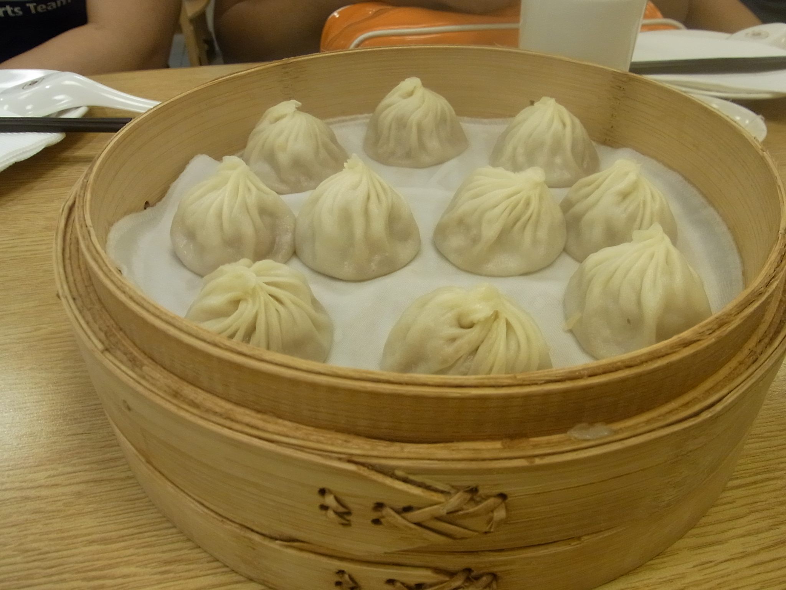

=======
 Day 0
=======

PyCon Taiwanについて
====================
`PyCon Taiwan 2012 <http://tw.pycon.org/2012/>`_ は世界中で開催されている
`PyCon <http://pycon.org/>`_ (Python Conference)のひとつで、2012年に初めて開催されます。
日本でも `PyCon JP 2012 <http://2012.pycon.jp/>`_ が9月中旬に開催され、現在講演内容を募集中です。

PyCon Taiwan 2012 の開催概要は以下のようになります。

:期間: 2012年6月9日、10日の2日間
:構成: 2つの基調講演を含むシングルトラック
       (`Program / PyCon Taiwan 2012 <http://tw.pycon.org/2012/program/>`_)
:参加費用: Early Bird(早期割引)1,300 TWD、通常 1,500 TWD
:会場: `Academia Sinica <http://www.sinica.edu.tw/main_e.shtml>`_
:参加人数: 260名(スタッフ除く)

昨年開催された PyCon JP 2011 に台湾から二人のスピーカーが参加してくれたということや、台湾で初めて開催される PyCon を応援したいという気持ちもあり、日本から PyCon JP のスタッフを中心に **9名** の日本人が参加しました。最初は4人くらいだったんですが、あれよあれよと参加者が増えて大所帯になりました。

.. list-table::
   :widths: 30 70

   * - 寺田 学(`@terapyon <http://twitter.com/terapyon>`_)
     - PyCon JP 2012 座長、ツアーコンダクター
   * - 清水川 貴之(`@shimizukawa <http://twitter.com/shimizukawa>`_)
     - PyCon JP 2012 副座長、撮影担当
   * - 保坂 翔馬(`@shomah4a <http://twitter.com/shomah4a>`_)
     - PyCon JP 2012 広報、プレゼン担当
   * - 森本 哲也(`@t2y <http://twitter.com/t2y>`_)
     - `Python Software Foundation <http://www.python.org/psf/>`_ メンバー、記事執筆担当
   * - 池 徹(`@rokujyouhitoma <http://twitter.com/rokujyouhitoma>`_)
     - `PyPy-ja <https://groups.google.com/forum/?fromgroups#!forum/pypy-ja>`_ 総帥、迷子担当
   * - 村岡 ゆうすけ(`@jbking <http://twitter.com/jbking>`_)
     - PyPy-ja メンバー、未払い担当
   * - 西本 卓也 (`@24motz <http://twitter.com/24motz>`_)
     - `NVDA日本語チーム <http://ja.nishimotz.com/nvdajp>`_ 、記事執筆担当
   * - 鈴木 たかのり(`@takanory <http://twitter.com/takanory>`_)
     - PyCon JP 2012 スポンサー担当、記事執筆担当
   * - 文殊堂(`@monjudoh <http://twitter.com/monjudoh>`_)
     - グルメ担当、PyCon Taiwan には参加せず台湾旅行を満喫

.. figure:: _static/japan-members.jpg
   :width: 480
   :alt: PyCon Taiwan 参加メンバー

   PyCon Taiwan 参加メンバー

travel: 旅行
------------
PyCon Taiwan へ参加するためにかかった費用は次の通りです。実際には3泊する人や違う航空会社を使った人などもいましたが、一番多い旅程はこんな感じでした。

.. 私のではなくメインのプランにする

.. figure:: _static/airplane.jpg
   :width: 320
   :alt: China Air

   China Air

.. list-table::
   :widths: 80 20
   :header-rows: 1

   * - 項目
     - 金額(円)
   * - Paicon Taiwan(早期申込割引): 1,300 TWD
     - 3,454
   * - ホテル宿泊費(2泊)
     - 8,817
   * - 往復航空券(空港税、サーチャージ等含む)
     - 43,740
   * - 合計
     - 57,115

これ以外に食費や現地での移動費(MRT、タクシー等)がかかりますが、総じて物価が安いので3、4日であればぜいたくしなければ1万円くらいの現金で余裕で過ごすことができます。

また飛行機は羽田空港−松山空港を選んだんですが、どちらも中心部からのアクセスが(成田、桃園に比べて)よく、さらに羽田空港の国際線ターミナルは空いていたので移動は快適でした。

Mozzila 台湾訪問
================
(もりもと担当)

NVDA関連ミーティング
====================
(西本担当)

台湾レポート
============
ここでは0日目の私の行動をもとに台湾での過ごし方について簡単にレポートします。
ちなみに私は台湾に訪れるのは初めてでした。

私は朝早く起きる(6時羽田集合!!)のがいやだったので、他の人とは別行動で台北に向かいました。羽田空港の新国際ターミナルは非常にきれいで、出発ロビーの上の階には「江戸小路(えどこうじ)」なる小さなショッピングスペースがあります。ここには手ぬぐい、風呂敷など日本ならでは商品が多く扱ってあり、海外から訪れた人も喜びそうです。

.. figure:: _static/edo-komichi.jpg
   :width: 320
   :alt: 江戸小路

   江戸小路

私が乗った機体には座席のモニターの横に USB ポートがついていました(初めて見ました)。試しに Nexus S をつないでみると充電がされ、台北に到着する頃には万充電の状態になりました。私は試せませんでしたが、iPhone を接続してその中の音楽を聞いたりすることができるようです。便利な世の中になったものです。

今調べてみたら `全席に電源がついて <http://www.ana.co.jp/int/inflight/guide/y/seat/767_300er_new/>`_ いたようです。とくに Mac のバッテリーには困りませんでしたが、次回乗ることがあったら有効に使ってみようと思います。

.. figure:: _static/usb-port.jpg
   :width: 320
   :alt: 座席のUSBポート

   座席のUSBポート

空港に到着したら最初にすることは両替もありますが、通信環境の確保も大事です。
松山空港内には中華電信の窓口があり、ここで台湾で使える SIM カードを購入することができます。ここではデータ通信専用の SIM を3日250台湾ドルで購入しました。ちなみに初日は無料で購入した3日後の23:59まで使用できるので非常にお得です。
店員さんも手慣れたもので、スムーズに通信確認ができました。SIM フリーの端末を持っている人にはおすすめです。

.. figure:: _static/sim-card.jpg
   :height: 320
   :alt: 短期間データ通信プラン

   短期間データ通信プラン

SIM を無事購入したのでホテルに移動します。台湾はタクシーも安いのでそれでもよいのですが、私は旅先の公共交通機関で移動するのが好きなので、MRT(台北の地下鉄)で移動します。台北市内のMRT、鉄道、バスで使用できる
`EasyCard <http://www.easycard.com.tw/english/index.asp>`_ という Suica と同じような便利なカードを入手して、無事ホテルまで移動しました。

ただし、駅で入手できる EasyCard は 500 台湾ドル(デポジット100台湾ドル含む)という料金になっており、普通に移動しているだけではなかなか使いきれません。コンビニ等でも使用できるので、そこでチャージした金額を減らすことをおすすめします。
実際私も全然使いきれませんでした。

.. figure:: _static/easy-card.jpg
   :height: 320
   :alt: Easy Card

   Easy Card

- ディン・タイ・フォンでディナー

   ディン・タイ・フォンの小籠包

- 士林夜市

.. figure:: _static/shilin-market.jpg
   :width: 320
   :alt: 士林夜市

   士林夜市(ナイト・マーケット)

.. figure:: _static/mango-ice.jpg
   :width: 320
   :alt: マンゴーのかき氷

   マンゴーのかき氷

