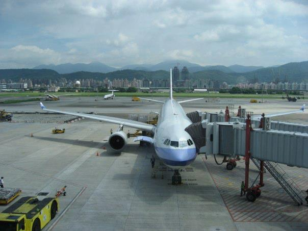

=======
 Day 0
=======

PyCon Taiwanについて
====================
`Python Conference(PyCon) <http://pycon.org/>`_ は世界中で開催されています。
`PyCon Taiwan <http://tw.pycon.org/2012/>`_ はそのうちのひとつで、2012年に初めて開催されました。
日本では2回目となる `PyCon JP 2012 <http://2012.pycon.jp/>`_ が9月中旬に開催さる予定で、現在 `講演内容を募集中 <http://2012.pycon.jp/cfp.html>`_ しています。

PyCon Taiwan 2012 の開催概要は以下のような内容でした。

:期間: 2012年6月9日、10日の2日間
:構成: 2つの基調講演を含むシングルトラック
       (`Program / PyCon Taiwan 2012 <http://tw.pycon.org/2012/program/>`_)
:参加費用: Early Bird(早期割引)1,300 TWD、通常 1,500 TWD
:会場: `Academia Sinica <http://www.sinica.edu.tw/main_e.shtml>`_
:参加人数: 260名(スタッフ除く)

昨年開催された PyCon JP 2011 に台湾から二人のスピーカーが参加してくれたということや、台湾で初めて開催される PyCon を応援したいという気持ちもあり、日本から PyCon JP のスタッフを中心に **9名** の日本人が参加しました。最初は4人くらいだったんですが、あれよあれよと参加者が増えて大所帯になりました。

.. list-table::
   :widths: 30 70

   * - 寺田 学(`@terapyon <http://twitter.com/terapyon>`_)
     - PyCon JP 2012 座長、ツアーコンダクター
   * - 清水川 貴之(`@shimizukawa <http://twitter.com/shimizukawa>`_)
     - PyCon JP 2012 副座長、撮影担当
   * - 保坂 翔馬(`@shomah4a <http://twitter.com/shomah4a>`_)
     - PyCon JP 2012 広報、プレゼン担当
   * - 森本 哲也(`@t2y <http://twitter.com/t2y>`_)
     - `Python Software Foundation <http://www.python.org/psf/>`_ メンバー、記事執筆担当
   * - 池 徹(`@rokujyouhitoma <http://twitter.com/rokujyouhitoma>`_)
     - `PyPy-ja <https://groups.google.com/forum/?fromgroups#!forum/pypy-ja>`_ 総帥、迷子担当
   * - 村岡 ゆうすけ(`@jbking <http://twitter.com/jbking>`_)
     - PyPy-ja メンバー、未払い担当
   * - 西本 卓也 (`@24motz <http://twitter.com/24motz>`_)
     - `NVDA日本語チーム <http://ja.nishimotz.com/nvdajp>`_ 、記事執筆担当
   * - 鈴木 たかのり(`@takanory <http://twitter.com/takanory>`_)
     - PyCon JP 2012 スポンサー担当、記事執筆担当
   * - 文殊堂(`@monjudoh <http://twitter.com/monjudoh>`_)
     - グルメ担当、PyCon Taiwan には参加せず台湾旅行を満喫

.. figure:: _static/japan-members.jpg
   :width: 480
   :alt: PyCon Taiwan 参加メンバー

   PyCon Taiwan 参加メンバー

travel: 旅行
------------
PyCon Taiwan へ参加するためにかかった費用は次の通りです。実際には3泊する人や違う航空会社を使った人などもいましたが、一番多い旅程はこんな感じでした。

.. 私のではなくメインのプランにする

   China Air

.. list-table::
   :widths: 80 20
   :header-rows: 1

   * - 項目
     - 金額(円)
   * - PyCon Taiwan(早期申込割引): 1,300 TWD
     - 3,454
   * - ホテル宿泊費(2泊)
     - 8,817
   * - 往復航空券(空港税、サーチャージ等含む)
     - 43,740
   * - 合計
     - 57,115

これ以外に食費や現地での移動費(MRT、タクシー等)がかかりますが、総じて物価が安いので3、4日であればぜいたくしなければ1万円くらいの現金で余裕で過ごすことができます。

また飛行機は羽田空港−松山空港を選んだんですが、どちらも中心部からのアクセスが(成田、桃園に比べて)よく、さらに羽田空港の国際線ターミナルは空いていたので移動は快適でした。

Mozilla Taiwan 訪問
===================

午後から寺田さんの知人であり `Mozilla Taiwan <http://moztw.org/>`_ でコミュニティマネージャーを務める Bob Chao 氏を訪問しました。
そこでは `PyCon JP 2011 に発表者として参加した Thinker Lee 氏 <http://2011.pycon.jp/program/talks#scribboo-with-embedded-python>`_ も働いていました。
Mozilla Taiwan は、2011年10月19日に設立されたばかりで、現在は開発者が25人、その他のスタッフが10人といった35人程度の組織のようです。

   Thinker Lee 氏 (左) と Bob Chao 氏 (右)

オフィスの休憩スペースでお互いの自己紹介を始め、それから1時間程度、ざっくばらんに歓談しました。
最初のうちは、双方ぎこちなかったものの、そこは開発者ならでは、スマートフォンを取り出して彼らの開発している
`Boot to Gecko (B2G) <http://www.mozilla.org/en-US/b2g/>`_ のデモを見せてもらい、話題に欠くことなく盛り上がりました。

B2G は、レンダリングエンジン Gecko を使ったブラウザベースの OS で、アプリケーションを HTML、CSS、JavaScript で開発できるのが特徴です。
実際に実機で紹介してもらったアプリは、WebGL のサンプル、電話をかける、カメラでの撮影、動画再生でした。
JavaScript、HTML など既存のウェブアプリケーションの技術をそのまま応用できるのが良いと思いました。

後述しますが、その日のディナーも彼らと一緒に楽しみました。
急な訪問にも関わらず、暖かく迎えて頂いた Bob Chao 氏と Thinker Lee 氏に感謝します。

   Mozilla Taiwan での集合写真

(もりもと担当)

NVDA関連ミーティング
====================
(西本担当)

台湾レポート
============
ここでは0日目の私の行動をもとに台湾での過ごし方について簡単にレポートします。
ちなみに私は台湾に訪れるのは初めてでした。

私は朝早く起きる(6時羽田集合!!)のがいやだったので、他の人とは別行動で台北に向かいました。羽田空港の新国際ターミナルは非常にきれいで、出発ロビーの上の階には「江戸小路(えどこうじ)」なる小さなショッピングスペースがあります。ここには手ぬぐい、風呂敷など日本ならでは商品が多く扱ってあり、海外から訪れた人も喜びそうです。

.. figure:: _static/edo-komichi.jpg
   :width: 320
   :alt: 江戸小路

   江戸小路

私が乗った機体には座席のモニターの横に USB ポートがついていました(初めて見ました)。試しに Nexus S をつないでみると充電がされ、台北に到着する頃には満充電の状態になりました。私は試せませんでしたが、iPhone を接続してその中の音楽を聞いたりすることができるようです。便利な世の中になったものです。

今調べてみたら `全席に電源がついて <http://www.ana.co.jp/int/inflight/guide/y/seat/767_300er_new/>`_ いたようです。とくに Mac のバッテリーには困りませんでしたが、次回乗ることがあったら有効に使ってみようと思います。

   座席のUSBポート

空港に到着したら最初にすることは両替もありますが、通信環境の確保も大事です。
松山空港内には中華電信の窓口があり、ここで台湾で使える SIM カードを購入することができます。ここではデータ通信専用の SIM を3日250台湾ドルで購入しました。ちなみに初日は無料で購入した3日後の23:59まで使用できるので非常にお得です。
店員さんも手慣れたもので、スムーズに通信確認ができました。SIM フリーの端末を持っている人にはおすすめです。

   短期間データ通信プラン

SIM を無事購入したのでホテルに移動します。台湾はタクシーも安いのでそれでもよいのですが、私は旅先の公共交通機関で移動するのが好きなので、MRT(台北の地下鉄)で移動します。台北市内のMRT、鉄道、バスで使用できる
`EasyCard <http://www.easycard.com.tw/english/index.asp>`_ という Suica と同じような便利なカードを入手して、無事ホテルまで移動しました。

ただし、駅で入手できる EasyCard は 500 台湾ドル(デポジット100台湾ドル含む)という料金になっており、普通に移動しているだけではなかなか使いきれません。コンビニ等でも使用できるので、そこでチャージした金額を減らすことをおすすめします。
実際私も全然使いきれませんでした。

   Easy Card

`ホテル <http://www.nc-hotel.com.tw/>`_ に無事到着し、Mozilla Taiwan や寺田さんの台湾の友達も交えてのディナーに向かいます。
お店は定番の `鼎泰豊(ディンタイフォン) <http://www.dintaifung.com.tw/jp/index.asp>`_ です。本店は狭くてだいぶ待つらしいので忠考店へ。定番の小籠包をはじめ前菜、チャーハン、スープなど、どの料理もとてもおいしく、日本語、英語、中国語が飛び交う楽しい時間を過ごしました。

   ディン・タイ・フォンの小籠包

ディナーを食べた後何人かで士林夜市に繰り出しました。台湾には夜市(ナイトマーケット)という露天が軒をつらねた祭りの出店のようなものが、毎日開催されています。
台北で周辺でいくつかある夜市のうちでも最も規模が大きいものがこの「士林夜市」です。
食べ物の屋台だけでなく、射的やスマートボールのようなゲーム、洋服や靴が売っていたりとまさになんでもありです。

.. figure:: _static/shilin-market.jpg
   :height: 320
   :alt: 士林夜市

   士林夜市(ナイト・マーケット)

食後のデザートが食べたいなということで、士林夜市の中にある地元の方おすすめのかき氷屋さんに連れて行ってもらいました。ここのかき氷(雪片氷)には氷自体にマンゴー・ミルクなどの味がついていて、しかもふわふわで非常においしかったです。地元の人のおすすめはハズレが無いですね。

私以外のメンバーは昼の Mozilla Taiwan 訪問後にも `マンゴーかき氷を食べた <https://twitter.com/sakura0217/status/211036403486830592>`_ そうですが、グルメ担当曰く「全く別のもの」ということで、士林夜市に来て大正解でした。

.. figure:: _static/mango-ice.jpg
   :width: 320
   :alt: マンゴーのかき氷

   マンゴーのかき氷

参考までに私が0日目に使ったお金を載せておきます。

.. list-table::
   :header-rows: 1
   :widths: 40 40 20

   * - 項目
     - 金額(TWD)
     - 日本円
   * - 空港で両替(1TWD=約2.726円)
     - 3,698
     - 10,000 
   * - SIMカード(3日間データ)
     - 250
     - 681.57
   * - EasyCard
     - 500
     - 1,363.14
   * - お茶(ペットボトル)
     - 25
     - 68.16
   * - 鼎泰豊ディナー
     - 台湾メンバーにおごってもらったので不明
     - 
   * - 屋台のフルーツ盛り合わせ
     - 200
     - 545.26
   * - かき氷
     - 60
     - 163.58
   * - お茶(ペットボトル)
     - 25
     - 68.16
   * - 残金
     - 2,608
     - 7,110.14

さて、明日からいよいよ PyCon Taiwan 2012 が開幕します。
