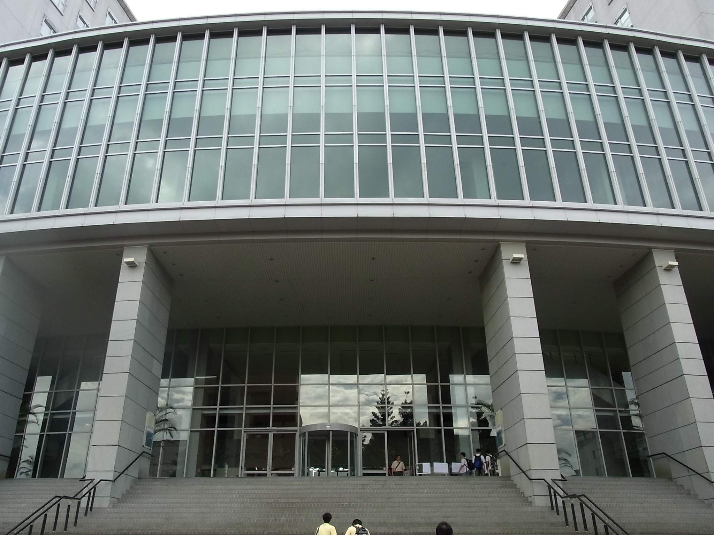
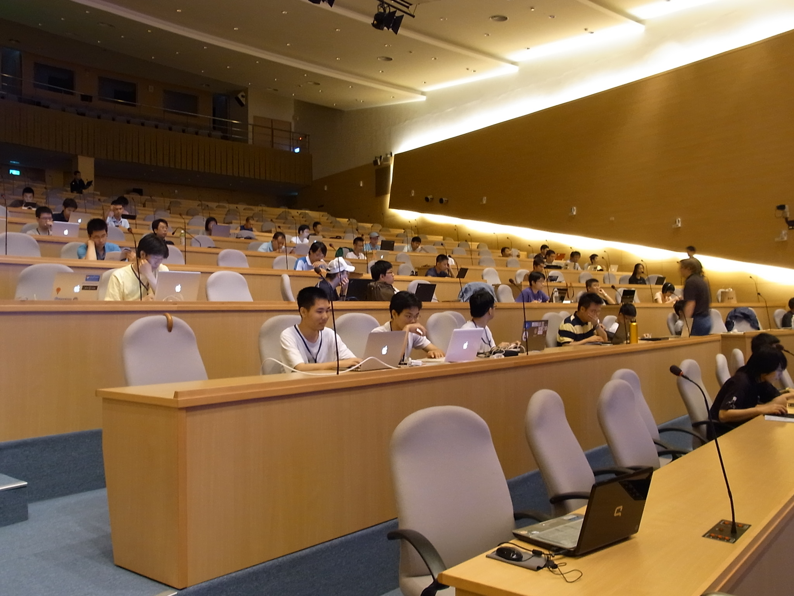
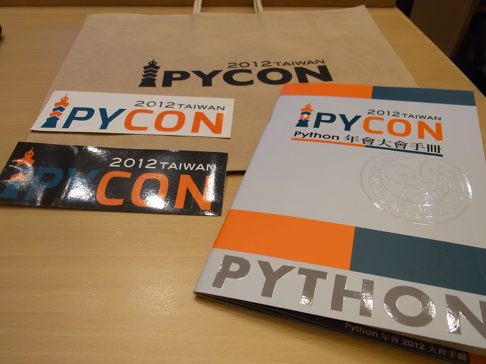
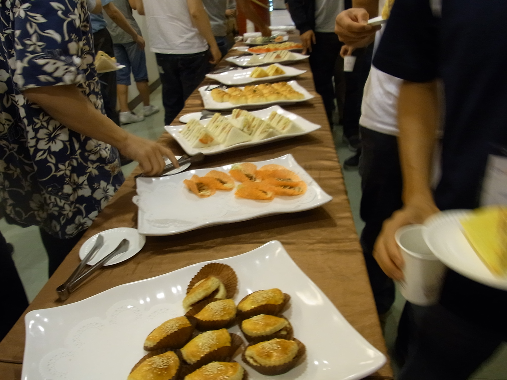
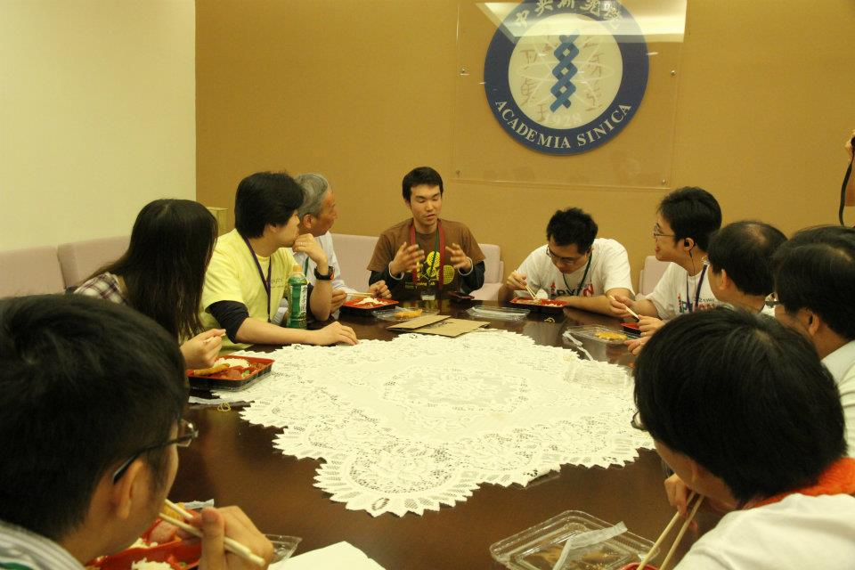
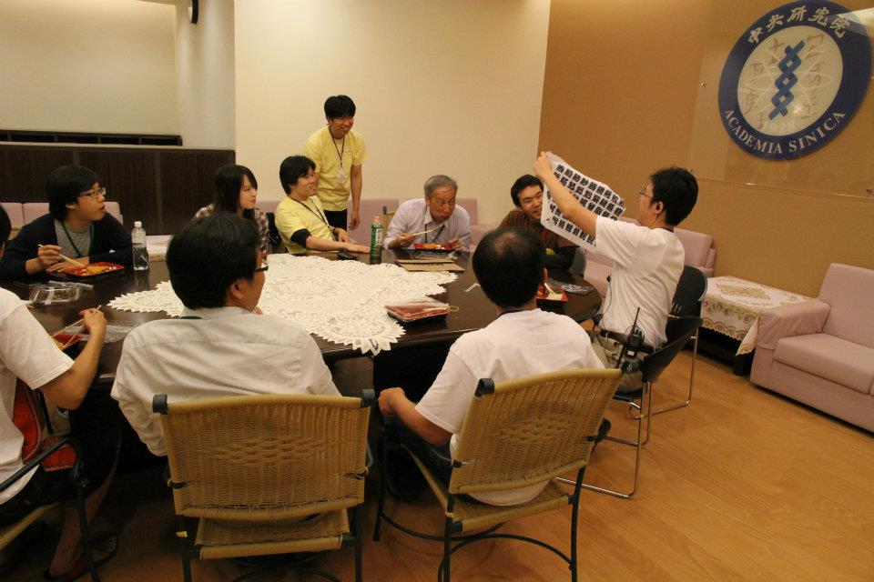

=======
 Day 1
=======

さて、ついに `PyCon Taiwan 2012 <http://tw.pycon.org/2012/>`_ がはじまります。
朝食を食べてから台北市内のホテルをチェックアウトし、タクシーで会場へ向かいます。会場の `Academia Sinica <http://www.sinica.edu.tw/main_e.shtml>`_ は台北市郊外にあり、駅から多少距離があるためタクシーでの移動が便利です。

会場となる Academia Sinica の中にある国際会議場です。台北で行われているオープンソース関連のイベントでは非常によく利用されている会場だそうですが、とても立派で綺麗な会場でした。

   Academia Sinica 国際会議場外観

さて入場登録をして会場に入ろうと思った時に事件が発生しました。

なんと日本からの参加者の一人 `@jbking <http://twitter.com/jbking>`_ が PyCon Taiwan の参加申込をしていないと言うのです!!確かに彼が「じゃあ私も行く」と言ったのは他のメンバーがチケット購入とかを済ませていたので、話題に上がらなかったということはありますが、なんというミス...会場入りの直前に挨拶を交わしていた PyCon Taiwan の chairperson(座長) の Yung-Yu Chen 氏に事情を説明し、なんとか当日支払いで会場に入れてもらい、事なきを得ました。

もしも海外から参加して「チケットがないから入れない」ということになったら、泣くに泣けないですね。まぁ、さすがにオープンソース系のイベントでそんなことにはならないとは思いますが。

   国際会議場

Keynote
=======
- Large-scale array-oriented computing with Python
- `Travis E. Oliphant <http://tw.pycon.org/2012/speaker/#travis_oliphant>`_
- Python どれくら使ってる?
- My Roots 海洋のセンサー
- Science led to Python
- 波の画像処理とか
- 1996 年(1.4)からpythonを使い始めた
- Numpy, SciPy の歴史
- Jim Fultonなんだ!!
- Why Python for Technical Computing

array-oriented
--------------
- 配列の計算してみる
- 再起よりはIterative
- でもそれより numpy, scipy が速い
- Life game: 処理はやい
- Immediate mode だとtemporaryをたくさんとるよ

- Blaze というインプロジェクト
- NumPy + Mamba = Numba: お金頂戴
- `NumFOCUS Foundation <http://numfocus.org/>`_
- Small device で numpy とか→まぁ計画はないよね

Clime: Simply CLI-iize Your Program!
====================================
- Mosky: http://www.facebook.com/mosky.liu
- https://github.com/moskied/clime
- http://pypi.python.org/pypi/clime
- http://docs.mosky.tw/clime/
- コメントに書いてあるものを使って勝手にコマンドラインで呼べるようにしてくれる
- かわいいは正義
- ハッ
- http://www.pinkoi.com/page/pinkoier

Even Faster Django
==================
- MongoDB使う→Southいらない
- Jinja2 を使う
- Django-BigPipe(jquery-bigpipe)
- Genie Dev Team

Panoramic Video in Environmental Monitoring
===========================================
- Jay William Johnson
- Ladybug API があるので、ctypes でつないで Python でアプリケーション作った

NLTK
====
- http://www.ezpao.com/

気になったセッション
====================
(それぞれで書く)

Lightning Talks
===============

All-In-One Scientific Research With SageTeX
-------------------------------------------
- Hsin-Yu Ko
- コードとドキュメントをどうするか
- http://www.sagemath.org/doc/tutorial/index.html

fabric-deployment tool
----------------------
- jslee
- Yahoo では yinst という perl の deployment tool 使ってた
- 今は fabric 使ってるよ

Simple Way Adding GUI to Python Scripts
---------------------------------------
- hychen
- I wrote a script
- zenity
- https://github.com/hychen/vsgui

PySX, a playstation emulator in python
--------------------------------------
- Tzer-Jen Wei
- 変態

Osube - Represent You
---------------------
- Scott Lambert
- osube.com
- Comming soon
- 動画を作って共有する
- Django ベース
- OSUBE Cafe があるよ meetup してね

PYTHON AND STARTUP
------------------
- Tom Chen: yychen

PyCon Taiwanの雰囲気
====================
来場者へのおみやげは紙袋に入って配られました。
中身はプログラムガイドの冊子とステッカーが2枚入っていました。
PyCon Taiwan の `TAIPEI 101 <http://www.taipei-101.com.tw/index_jp.htm>`_ と蛇をかけ合わせたロゴはとてもステキだと思います。ただ、ステッカーは少しサイズが大きすぎるので、自分の MacBook Air には貼らずにお土産にしました。

   PyCon Taiwan グッズ

会期中は2日間とも午前と午後に Tea Break、昼にランチタイムが設けられました。
Tea Break では軽食やケーキ、ベジタリアンの方向けのものまで用意されており、非常に充実していました。

   Tea Break の様子

また、ランチはお弁当が出るんですが、私たちは発表者やスタッフが使用する VIP ROOM で一緒に食事をさせてもらいました。
そのおかげで台湾のスタッフやスピーカーと交流できて、非常に濃密な時間を過ごすことができました。

   ランチタイムの風景

   日本からのおみやげに喜ぶ Yung-Yu Chen 氏

PyCon Taiwan 1日目終了
======================
(PyCon Taiwan 1日目終了ホテルのことを書く)

(またナイトマーケットに行ったことを書く)

この日に私が使ったお金を載せておきます。

.. list-table::
   :header-rows: 1
   :widths: 40 40 20

   * - 項目
     - 金額(TWD)
     - 日本円
   * - 前日の残金
     - 2,608
     - 7,110.14
   * - ホテル代
     - 事前に支払い済
     -
   * - タクシー
     - 370
     - 1,008.72
   * - 猪脚細麺
     - 120
     - 327.15
   * - かき氷
     - 50
     - 136.31
   * - 西瓜汁
     - 20
     - 54.53
   * - おみやげ(7-11)
     - 509
     - 1,387.68
   * - 残金
     - 1,539
     - 4,195.75

次回予告
========
さて、次回は PyCon Taiwan 2日目の様子をお届けします。ついに最大の目的である日本参加者のプレゼンが行われます。
