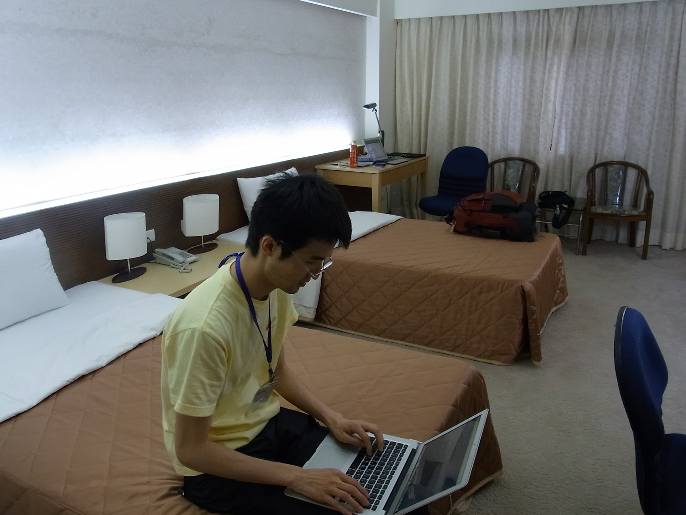
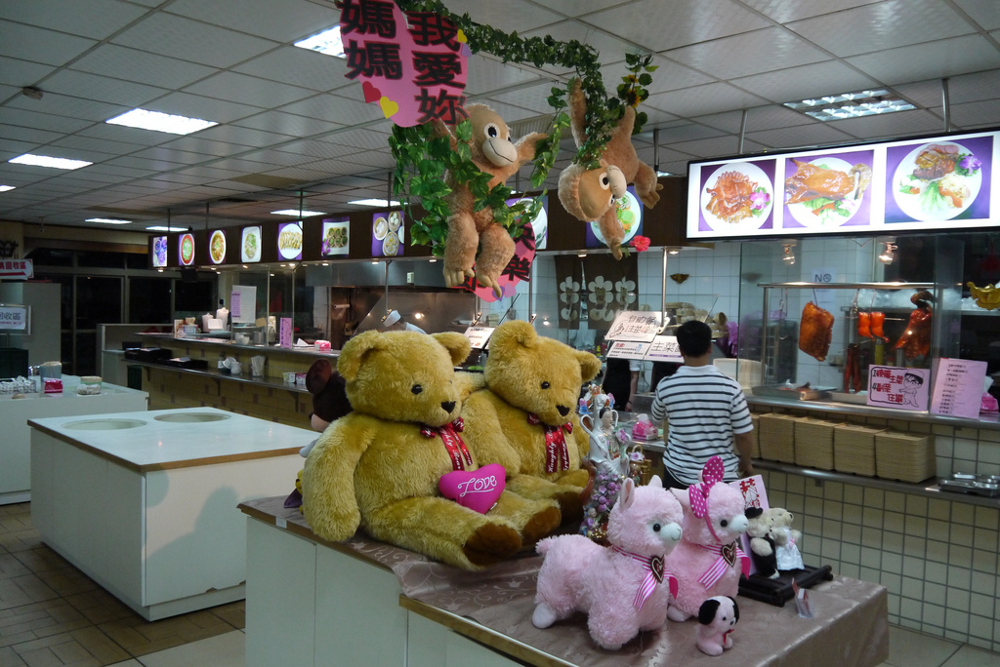

=======
 Day 1
=======

さて、ついに `PyCon Taiwan 2012 <http://tw.pycon.org/2012/>`_ がはじまります。
朝食を食べてから台北市内のホテル(`中源大飯店 <http://www.tripadvisor.jp/Hotel_Review-g293913-d1645926-Reviews-New_Continental_Hotel-Taipei.html>`_)をチェックアウトし、タクシーで会場へ向かいます。会場の `Academia Sinica <http://www.sinica.edu.tw/main_e.shtml>`_ は台北市郊外にあり、駅から多少距離があるためタクシーでの移動が便利です。

会場は Academia Sinica(中央研究院)の敷地内にある Humanities & Social Sciences Building(人文社會科學館)という建物の International Conference Hall(國際會議廳)です。台北で行われているオープンソース関連のイベントでは非常によく利用されている会場だそうですが、とても立派で綺麗な会場でした。

.. figure:: _static/academia-sinica.jpg
   :width: 480
   :alt: 人文社会科学館の外観

   人文社会科学館の外観

さて入場登録をして会場に入ろうと思った時に事件が発生しました。

なんと日本からの参加者の一人、村岡さんが PyCon Taiwan の参加申込をしていないと言うのです!!確かに彼が「じゃあ私も行く」と言ったのは他のメンバーがチケット購入とかを済ませていたので、話題に上がらなかったということはありますが、なんというミス...会場入りの直前に挨拶を交わしていた PyCon Taiwan の chairperson(座長) Yung-Yu Chen 氏に事情を説明し、なんとか当日支払いで会場に入れてもらい事なきを得ました。

もしも海外から参加して「チケットがないから入れない」ということになったら、泣くに泣けないですね。まぁ、さすがにオープンソース系のイベントでそんなことにはならないとは思いますが、みなさん海外の技術系イベントに参加するときにはご注意ください。

.. figure:: _static/conference-center.jpg
   :width: 480
   :alt: PyCon Taiwan 会場の国際会議場

   PyCon Taiwan 会場の国際会議場

PyCon Taiwan のタイムテーブルと各資料へのリンクは以下のページから参照できます。

- `Program / PyCon Taiwan 2012 <http://tw.pycon.org/2012/program/>`_

Keynote: Large-scale array-oriented computing with Python
=========================================================
もりもとです。
最初の基調講演は `Travis Oliphant 氏 <http://technicaldiscovery.blogspot.com/>`_ による、
科学技術分野の Python 実績や用途、関連プロジェクト、今後の展望について紹介したものでした。
彼は `SciPy <http://www.scipy.org/>`_ や `NumPy <http://numpy.scipy.org/>`_ の開発者であり、
`Guide to NumPy <http://www.tramy.us/guidetoscipy.html>`_ (パブリックドメインで公開) の著者です。
もともとは科学者でしたが、科学系ソフトウェアの開発者に転向したようです。

.. figure:: _static/travis_oliphant.jpg
   :width: 320
   :alt: Travis Oliphant 氏 

   Travis Oliphant 氏 

以下に彼の経歴や発表スライドが公開されています。

- `Travis Oliphant 氏の経歴 <http://tw.pycon.org/2012/speaker/#travis_oliphant>`_
- `Slide: Large-scale array-oriented computing with Python <http://www.slideshare.net/pycontw/largescale-arrayoriented-computing-with-python>`_

What is wrong with Python?
--------------------------

.. figure:: _static/keynote1_what_is_wrong_with_python.jpg
   :width: 320
   :alt: Python の悪いところ

   Python の悪いところ

この前のスライドで Python の良いところを説明していました。
Python の良いところは、調べればたくさん見つけられるので、ここでは悪いところのみを紹介します。
自分が取り組んでいるプロジェクトやソフトウェアの良いところ、
悪いところを認識しておくのは、適材適所を選択したり、活用する上で重要なことだと思います。

スライドから引用しながら補足します。いくつか納得する項目もあるものの、いま正に改善しようと取り組んでいる項目もあります。

* パッケージングがまだ万全というわけじゃない (distribute, pip, distutils2 が期待通りではない)

  Python 3.3 から `packaging (distutils2) <http://docs.python.org/dev/library/packaging.html#module-packaging>`_ ライブラリが導入予定でしたが、
  現時点の開発状況を鑑みて 3.4 に延期しようという話題が開発者メーリングリストで行われています。まだもう少し時間がかかりそうです。

* 匿名ブロック (Anonymous Block) がない

  "Anonymous Block" で調べると `PEP 343 The "with" Statement <http://www.python.org/dev/peps/pep-0343/>`_ が出てくるのですが、
  ここで言う匿名ブロックとは、lambda ブロックのような、ファーストクラスオブジェクトのブロックではないかと疑問に思いました。

* CPython ランタイムは、古くなってしまったので改良が必要 (GIL, グローバル変数、動的コンパイル対応)
* 軽量 DSL を作るために必要な言語拡張の仕組みが "import hooks" しかない

  Python 3.1 から追加された `importlib <http://docs.python.org/dev/library/importlib.html>`_ で解決しようとしています。
  importlib は Python の import 文の実装を提供し、Python のランタイムに依らず、様々な API とフックを提供することで拡張を簡単にします。

* 複数のランタイムの煩わしさ

  `PyPy <http://pypy.org/>`_ の人気が出て来て、Cross-Python というキーワードもちらほら聞くようになりました。
  従来からの `Jython <http://www.jython.org/>`_, `IronPython <http://ironpython.codeplex.com/>`_ に加え、
  Python 3 への移行も着実に進む中、いまが過渡期なので仕方ないですね。

* 配列指向 (array-oriented) と NumPy を完全に理解している Python 開発者が少ない

Array-Oriented Computing
------------------------

配列指向 (Array-Oriented) の解法例として、フィボナッチ数列を求める実装とそのベンチマーク結果を紹介していました。

* イテレーティブな実装

.. code-block:: python

    def fib1(N):
        """
        >>> fib1(10)
        [0, 1, 1, 2, 3, 5, 8, 13, 21, 34]
        """
        result = [0, 1]
        for k in range(2, N):
            result.append(result[k - 1] + result[k - 2])
        return result

* Formula を使った実装

.. code-block:: python

    from numpy import roots, arange

    r1, r2 = roots([1, -1, -1])
    C = 1.0 / (r1 - r2)

    def fib2a(N):
        """
        >>> fib2a(10)
        array([  0.,   1.,   1.,   2.,   3.,   5.,   8.,  13.,  21.,  34.])
        """
        n = arange(N, dtype=float)
        return C * (r1 ** n - r2 ** n)

* LFilter を使った実装

.. code-block:: python

    from scipy import array
    from scipy.signal import lfilter
    from numpy import zeros

    b = array([1.0])
    a = array([1., -1, -1])
    zi = array([0, 1.0])

    def fib3a(N):
        """
        >>> fib3a(10)
        array([  0.,   1.,   1.,   2.,   3.,   5.,   8.,  13.,  21.,  34.])
        """
        y, zf = lfilter(b, a, zeros(N, dtype=float), zi=zi)
        return y

これらの実装によるベンチーマーク結果です。

.. figure:: _static/keynote1_array-oriented_approaches.jpg
   :width: 320
   :alt: 配列指向の実装によるベンチマーク比較

   配列指向の実装によるベンチマーク比較

筆者は、SciPy/NumPy に明るくないので Formula や LFilter を使った実装のアルゴリズムを理解できていませんが、
イテレーティブな実装よりも高速に動作するというのが衝撃的でした。
試しに私の環境でも IPython で計測してみました。スライドのベンチマークと同じような結果が得られました。

.. code-block:: python

    In [11]: timeit -n 3 iterative_fib.fib1(1000)
    3 loops, best of 3: 752 us per loop

    In [12]: timeit -n 3 using_formula.fib2a(1000)
    3 loops, best of 3: 348 us per loop

    In [13]: timeit -n 3 using_lfilter.fib3a(1000)
    3 loops, best of 3: 54.6 us per loop

関連プロジェクト
----------------

その他にも NumPy の良いところ、悪いところ、Zen of NumPy といった NumPy の特徴や、
`ndarray <http://docs.scipy.org/doc/numpy/reference/generated/numpy.ndarray.html>`_ オブジェクトによる配列指向の応用や考え方を説明されていました。
発表の中で触れられた SciPy/NumPy に関連するプロジェクトを紹介します。

* Blaze プロジェクト

  次世代 NumPy と `PyTables <http://www.pytables.org/moin/PyTables>`_ による `out-of-core <http://en.wikipedia.org/wiki/Out-of-core_algorithm>`_ な仕組みや分散テーブルを提供する

* `Numba <https://github.com/ContinuumIO/numba>`_ プロジェクト

  LLVM で Python のバイトコードをコンパイルして NumPy のランタイムを最適化する 

* `pandas <http://pandas.pydata.org/>`_

  高速、且つ汎用的なデータ生成／解析のためのライブラリやそのツール

筆者は、業務アプリや Web アプリの開発を主にしてきたので、こういった科学技術分野の動向は全く分かりません。
しかし、ソーシャル化による集合知や Big Data 解析といった話題が、今後より一般的になるにつれて関わることも増えてきそうな気がします。
そんなとき、Python でプログラミングできることを想像すると、新しい分野に対しても挑戦する意欲がわいてきます。

Clime: Simply CLI-ize Your Program!
===================================
鈴木たかのりです。
Keynote のあとはティータイムをはさんで1枠30分の通常のセッションが始まります。
ここでは一つ目の発表 Mosky さんによる `Clime <http://pypi.python.org/pypi/clime>`_ のセッションを紹介します。

   Mosky さん

以下に Mosky さんの発表スライドが公開されています。

- `20120609 Clime @ PyCon <https://docs.google.com/presentation/pub?id=12hNvoRf0ogHFA9zrnjYycBI1b9ROWVyy5v1ArjtjVpY#slide=id.g11698afd_2_46>`_

Mosky さんは現在 `Pinkoi <http://www.pinkoi.com/>`_ という企業でインターンとして働いている、台北の大学生です。
Pinkoi は台湾のデザイナーが作った商品を販売するためのプラットフォームのようで、バックエンドには Python が使われています。サイトを見てみると `Etsy <http://www.etsy.com/>`_ の台湾版という感じで、台湾のデザイナー等が作成したハンドメイドのプロダクトを売買するマーケットのようです。

彼女は他にも `Ubuntu-tw <http://www.ubuntu-tw.org/>`_ のメンバーだったり、
`COSCUP <http://coscup.org/2012/en/>`_ という台湾の OSC (Open Source Conferecen)のようなイベントのスタッフだったりと、精力的に OSS 関連の活動をしているようです。若いのにすごいなーと感心しました。

本題の Clime 説明ですが、Clime は CLI-ize ME の略で様々な Python の関数を CLI(Command Line Interface)で呼び出せるようにするというモジュールです。

ある日 Mosky さんは ``initdb.py``, ``cleardb.py`` をコマンドラインから呼び出すために ``db.py init``, ``db.py clear`` として実行できるようにしようと
`argparse <http://www.python.jp/doc/release/library/argparse.html>`_
を使おうと思ったけど挫折したそうです(笑)。
そこで、コマンドラインで ``db.py init`` 、 ``db.py clear`` と実行すると **db.py** の中の **init()**, **clear()** を呼び出すという方法がシンプルでよいのではないかと考えて Clime の作成に着手したそうです。

では実際に Clime を使って Python コードをコマンドラインインタフェースに対応させます。
Clime は
`PyPI(Python Package Index) で公開 <http://pypi.python.org/pypi/clime>`_
されているので、 **pip install clime** 等でインストールが可能です。
使い方は簡単で、例として以下のように指定された文字列を指定された回数繰り返す簡単な関数 **repeat()** を作成します。
3行目に **clime.now** を import しているのがポイントです。

.. code-block:: python
   :emphasize-lines: 3

   # filename: repeat.py

   import clime.now

   def repeat(string, time=2):
       '''repeat string n times

       options:
           -n N, --time N  repeat N times.
       '''

       print string * time

これだけで、 **repeat.py** がコマンドラインで実行できるようになります。
**docstring** に書いてある内容がヘルプで読み出せるのも非常に便利そうです。
以下が実行例です。

.. code-block:: sh

   $ python repeat.py twice
   twicetwice

   $ python repeat.py -n3 thrice
   thricethricethrice

   $ python repeat.py --help
   usage: [--time N | -n N] STRING
      or: repeat [--time N | -n N] STRING

   $ python repeat.py repeat --help
   usage: [--time N | -n N] STRING
      or: repeat [--time N | -n N] STRING

   repeat string n times

   options:
       -n N, --time N  repeat N times.

これだけです。シンプルですが、作成した関数を簡単にコマンドライン引数対応するにはなかなか面白い選択肢だなと感じました。

コードは Github の `moskied/clime <https://github.com/moskied/clime>`_ で管理されており、ドキュメントも 
`Clime v0.1.4 documentation <http://docs.mosky.tw/clime/>`_
で公開されていてものすごいきちんとしています。
後述するランチの時に、池さんが彼女に「素晴らしいプロダクトなのでぜひ継続して開発してほしい」と伝えたところ「Github にコードはあるので、協力待ってます!!」と答えていました。興味を持たれた方はぜひコードを見てみてください。

いくつかのセッション発表にあったのですが、自身が所属する会社で「人材募集していますよ」というスライドが入っていました。Mosky さんも `Pinkoi Want You! <http://www.pinkoi.com/page/pinkoier>`_ という形で紹介をしていました。詳細ページに行くと中国語で全然読めませんでしたが、人材募集が活発なのは非常にいいことだなーと思いました。

.. figure:: _static/pinkoi.jpg
   :width: 320
   :alt: Pinkoi Want You!

   Pinkoi Want You!

余談ですが、彼女はスライドをめくる時に「ハッ」「ハッ」と言っていて、日本からの参加者でウケていました。実際には「阿(ア)」らしく「◯◯なんですよね」の語尾の「ね」みたいに言い方をやわらげるときに使うそうです。台湾でプレゼンテーションするときにはぜひご活用ください。

Lightning Talks
===============

西本です。一日目の最後は閃電秀 (Lightning Talks) です。

(もうちょっと文章を...)

* All-In-One Scientific Research With SageTeX

  - スピーカー: Hsin-Yu Ko 
  - スライド: `Main by kosinyj <http://www.slideshare.net/kosinyj/main-13277848>`_

  `数式処理システム Sage <http://www.sagemath.org/>`_ (Sagemath) はいわゆる Mathematica のようなソフトウェアですが、Python を基盤としてオープンソースで開発されているのが特徴です。Sage のコードを LaTeX に埋め込む SageTeX という機能もあり、これを使えば計算結果やグラフを直接 LaTeX 文書に取り込むことができます。つまり「研究から論文作成まで」オールインワンの科学研究環境を実現できるわけです。

* fabric – deployment tool

  - スピーカー: jslee

  SSH で複数のマシンにデプロイを行うソフトウェア `fabric <http://docs.fabfile.org/>`_ の紹介です。Yahoo! Taiwan ではかつて yinst という perl ベースの独自ツールが使われていましたが、現在は fabric を使っているそうです。

* Simple Way Adding GUI to Python Scripts

  - スピーカー: hychen
  - スライド `讓 Python Script 擁有圖形化介面的簡單方法 <http://www.slideshare.net/pycontw/pycontw2012-lt>`_
  - ビデオ `PyConTW 2012 LT: VSGUI (very simple GUI) - Hychen <http://www.youtube.com/watch?v=WBqFVYdm-BE>`_

  PyCon JP 2011 でも発表してくれた hychen 氏による発表です。
  シェルスクリプトを介してコマンドラインから GTK+ ダイアログボックスを表示するツール `Zenity <http://ja.wikipedia.org/wiki/Zenity>`_ を、Python から簡単に使えるようにする `VSGUI <http://pypi.python.org/pypi/vsgui>`_ という自作ツールの紹介でした。

  以下の簡単なコードで、ファイル選択ダイアログの GUI を表示することができます。

.. code-block:: python

   from vsgui.api import *
   ret = ask_filepath(directory='/tmp')
   info(ret)

   vsgui で生成されたファイル選択ダイアログ

* PySX, a playstation emulator in python

  - スピーカー: Tzer-Jen Wei
  - スライド `Pysx presentation at Pycontw by weijr | SlideShare <http://www.slideshare.net/weijr/pysx-presentation-at-pycontw>`_

  PySX という Python で動作するプレイステーションのエミュレーターの紹介です。
  すでに プレイステーションのエミュレーターはこの世に存在するのに、あえて
  Python で実装し直すという、ある意味変態的なプロジェクトです。

  実際に PC 上でプレイステーションが起動する様子を見せてくれました。
  まだ、そのくらいしか動作していないそうです。

   プレイステーションの起動画面

* Osube - Represent You

  - スピーカー: Scott Lambert

  モバイルビデオに関するスタートアップ企業 `Osube <http://osube.com/>`_ の紹介です。
  Osube は PyCon Taiwan のスポンサー企業でもあります。
  まだサービスはリリースされていませんが、バックエンドは Django で開発をしているそうです。

   osube のアーキテクチャ

   また、台湾のオフィスには Osube Cafe というスペースがあり、meetup イベントなどに是非使ってくださいと言っていました。

* Python and Startup

  - スピーカー: yychen
  - スライド: `Python and Startup by pycontw <http://www.slideshare.net/pycontw/python-and-startup>`_

  Django と MongoDB などを使ってサービスを立ち上げた話しをしていました。
  https://www.house123.com.tw/ という不動産取引のためのサービスのようです。

.. PYTHON AND STARTUP
.. ------------------
.. - Tom Chen: yychen

科学技術からゲームまで、ツール紹介からビジネスまで、話題の幅が広い LT でした。

PyCon Taiwanの雰囲気
====================
再び、鈴木たかのりです。
ここではセッション以外の PyCon Taiwan の雰囲気について紹介したいと思います。

PyCon Taiwan では入場時におみやげのグッズがロゴ入りの紙袋に入って配られました。
中身はプログラムガイド(カラー)の冊子とステッカーが2枚入っていました。
PyCon Taiwan の `TAIPEI 101 <http://www.taipei-101.com.tw/index_jp.htm>`_ と蛇をかけ合わせたロゴはとてもステキだと思います。ただ、ステッカーは少しサイズが大きすぎるので、自分の MacBook Air には貼らずに日本へのお土産にしました。

.. figure:: _static/pycon-tw-goods.jpg
   :width: 320
   :alt: PyCon Taiwan グッズ

   PyCon Taiwan グッズ

会期中は2日間とも午前と午後に Tea Break、昼にランチタイムが設けられました。
Tea Break では軽食やケーキ、ベジタリアンの方向けのものまで用意されており、非常に充実していました。

   Tea Break の様子

また、ランチタイムには魚、鶏、豚などのお弁当が出ます。一般の参加者はカフェテリアのような場所で食事をとっていたようです。
私たちは発表者やスタッフが使用する VIP ROOM で一緒に食事をさせてもらいました。
そのおかげで台湾のスタッフやスピーカーと交流できて、非常に濃密な時間を過ごすことができました。

.. figure:: _static/bento.jpg
   :width: 320
   :alt: お弁当も中華

   お弁当も中華

.. figure:: _static/lunch.jpg
   :width: 320
   :alt: ランチタイムに PyCon Taiwan スタッフと交流

   ランチタイムに PyCon Taiwan スタッフと交流

   日本からのおみやげに喜ぶ Yung-Yu Chen 氏

Day 1 の終了後は BoF (Birds of a Feather)という形式のユーザー同士の集まりが開催されました。ノンアルコールでピザをつまんだりして活発に議論をしていたようです。台湾のみなさんは私とは違って真面目ですね!!

BoF は中国語のみのため私達は参加しませんでしたが、教育ツールとしての Python 、Python での Web 開発、Python の台湾グループの立ち上げなどについて、夜遅くまで議論が行われました。
BoF の内容については `PyCon.TW/2012/BoF - PyTUG wiki <http://wiki.python.org.tw/PyCon.TW/2012/BoF>`_ のページに中国語でまとめられています。

   BoF の様子

PyCon Taiwan 1日目終了
======================
この日は Academia Sinica の中にある宿泊施設を利用しました。
Center of Academic Activities(中央研究院學術活動中心)はホテルの他にレストラン、カフェなども併設している施設です。

ホテルの部屋は非常に広く快適で、無線LANにも繋がります。
また、学術関係の宿泊施設らしく机が二つあり、コンセントもたくさんついていて、私達のような人種には非常に便利でした。

日本から行った他のメンバーはホテルに併設してある中華レストランで夕食を食べたそうですが、安くて普通においしかったそうです。

   Academia Sinica の宿泊施設

   謎の可愛らしいディスプレイのレストラン

私はホテルのレストランでは食べず、昨日に引き続き夜市(ナイトマーケット)に出かけました。
この日行ったのは `饒河街観光夜市 <http://www.taipeinavi.com/food/229/>`_ です。Academia Sinica から少し距離があり、バスに乗って30分ほど移動する必要があります。ちなみにバスは東京に比べてスピードを出しますし結構揺れて少し気持ちが悪くなりました。

どうやっていくのか調べるために Android の Google マップで検索すると、Academia Sinica から夜市に行くための乗り降りするバス停、バスの系統番号まで表示されました。
右も左も分からない私でも安心して移動することができ、便利すぎてびっくりしました
(`夜市へのバスルート <https://maps.google.com/maps?saddr=%E6%8C%87%E5%AE%9A%E3%81%AE%E5%9C%B0%E7%82%B9&daddr=%E5%85%AB%E5%BE%B7%E8%B7%AF%E5%9B%9B%E6%AE%B5&hl=ja&ie=UTF8&ll=25.04898,121.599684&spn=0.051554,0.090895&sll=25.043732,121.594105&sspn=0.025778,0.045447&geocode=FT4afgEdCqo_Bw%3BFeA7fgEdvCA_Bw&dirflg=r&ttype=now&noexp=0&noal=0&sort=def&mra=ltm&t=m&z=14&start=0>`_)。

   バスの車内

   饒河街観光夜市の入り口

.. figure:: _static/yatai.jpg
   :width: 320
   :alt: 夕食は猪脚麺線(具に豚足の入った細い麺)

   夕食は猪脚麺線(具に豚足の入った細い麺)

   今日も食後にかき氷

   ところどころおかしな日本語

この日私が使ったお金はこんな感じです。
夜市にしか出かけていないので全然減っていません。
しかも夜市での買い食いよりも、その後のセブンイレブンの方がお金を使っているという事態になりました。

.. list-table::
   :header-rows: 1
   :widths: 40 40 20

   * - 項目
     - 金額(TWD)
     - 日本円
   * - 前日の残金
     - 2,608
     - 7,110.14
   * - ホテル代
     - 事前に支払い済
     -
   * - タクシー
     - 370
     - 1,008.72
   * - 猪脚細麺
     - 120
     - 327.15
   * - かき氷
     - 50
     - 136.31
   * - 西瓜汁
     - 20
     - 54.53
   * - おみやげ(セブンイレブン)
     - 509
     - 1,387.68
   * - 残金
     - 1,539
     - 4,195.75

次回予告
========
さて、次回は PyCon Taiwan 2日目の様子をお届けします。ついに日本から PyCon Taiwan に参加した最大の目的である「PyCon JP の宣伝プレゼン」が行われます。
