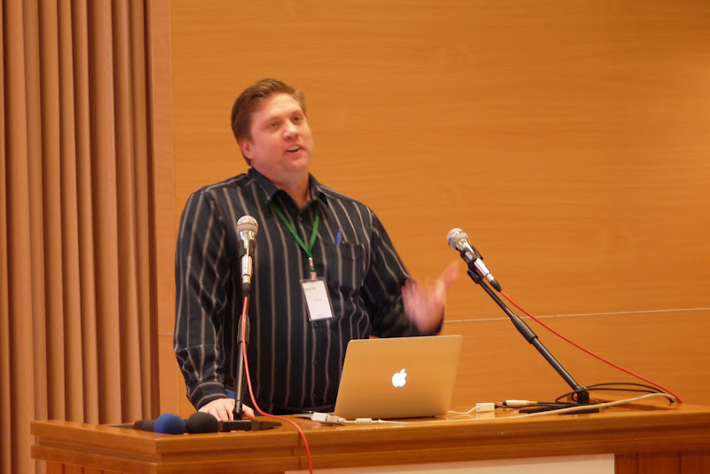
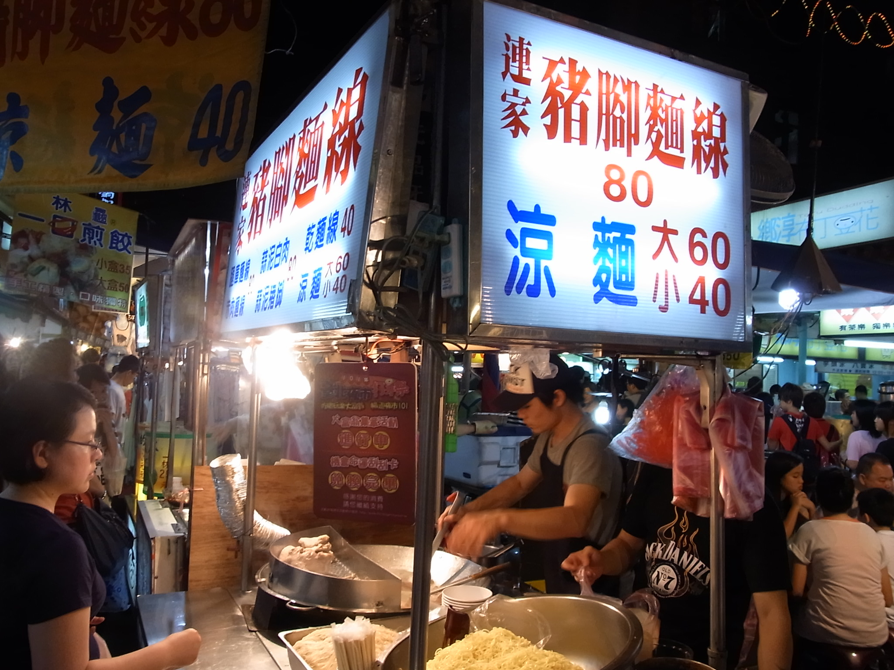

=======
 Day 1
=======

さて、ついに `PyCon Taiwan 2012 <http://tw.pycon.org/2012/>`_ がはじまります。
朝食を食べてから台北市内のホテル(`中源大飯店 <http://www.tripadvisor.jp/Hotel_Review-g293913-d1645926-Reviews-New_Continental_Hotel-Taipei.html>`_)をチェックアウトし、タクシーで会場へ向かいます。会場の `Academia Sinica <http://www.sinica.edu.tw/main_e.shtml>`_ は台北市郊外にあり、駅から多少距離があるためタクシーでの移動が便利です。

会場は Academia Sinica(中央研究院)の敷地内にある Humanities & Social Sciences Building(人文社會科學館)という建物の International Conference Hall(國際會議廳)です。台北で行われているオープンソース関連のイベントでは非常によく利用されている会場だそうですが、とても立派で綺麗な会場でした。

   自分社会科学館の外観

さて入場登録をして会場に入ろうと思った時に事件が発生しました。

なんと日本からの参加者の一人、村岡さんが PyCon Taiwan の参加申込をしていないと言うのです!!確かに彼が「じゃあ私も行く」と言ったのは他のメンバーがチケット購入とかを済ませていたので、話題に上がらなかったということはありますが、なんというミス...会場入りの直前に挨拶を交わしていた PyCon Taiwan の chairperson(座長) Yung-Yu Chen 氏に事情を説明し、なんとか当日支払いで会場に入れてもらい事なきを得ました。

もしも海外から参加して「チケットがないから入れない」ということになったら、泣くに泣けないですね。まぁ、さすがにオープンソース系のイベントでそんなことにはならないとは思いますが、みなさん海外の技術系イベントに参加するときにはご注意ください。

   PyCon Taiwan 会場の国際会議場

Keynote: Large-scale array-oriented computing with Python
=========================================================

最初の基調講演は `Travis Oliphant 氏 <http://technicaldiscovery.blogspot.com/>`_ による、
科学技術分野の Python 実績や用途、関連プロジェクト、今後の展望について紹介したものでした。
彼は `SciPy <http://www.scipy.org/>`_ や `NumPy <http://numpy.scipy.org/>`_ の開発者であり、
`Guide to NumPy <http://www.tramy.us/guidetoscipy.html>`_ (パブリックドメインで公開) の著者です。
もともとは科学者でしたが、科学系ソフトウェアの開発者に転向したようです。

   Travis Oliphant 氏 

以下に彼の経歴や発表スライドが公開されています。

- `Travis Oliphant 氏の経歴 <http://tw.pycon.org/2012/speaker/#travis_oliphant>`_
- `Slide: Large-scale array-oriented computing with Python <http://www.slideshare.net/pycontw/largescale-arrayoriented-computing-with-python>`_

What is wrong with Python?
--------------------------

   Python の悪いところ

この前のスライドで Python の良いところを説明していました。
Python の良いところは、調べればたくさん見つけられるので、ここでは悪いところのみを紹介します。
自分が取り組んでいるプロジェクトやソフトウェアの良いところ、
悪いところを認識しておくのは、適材適所を選択したり、活用する上で重要なことだと思います。

スライドでは以下のようにあります。

* パッケージングがまだ万全というわけじゃない (distribute, pip, distutils2 が期待通りではない)
* 匿名ブロック (Anonymous Block) がない
* CPython ランタイムは、古くなってしまったので改良が必要 (GIL, グローバル変数、動的コンパイル対応)
* "import hooks" 以外に言語を拡張する仕組みがない (軽量 DSL が必要とする)
* 複数のランタイムの煩わしさ
* 配列指向 (array-oriented) と NumPy を完全に理解している Python 開発者が少ない

いくつか納得する項目もあるものの、いま正に改善しようと取り組んでいる項目もあります。

.. warning::
   
  * 匿名ブロック (Anonymous Block) がない

  あとで travis に聞いてみる！
  ここで言う匿名ブロックとは `with 文 <http://www.python.org/dev/peps/pep-0343/>`_ ではなく、lambda block のようなもの？

|

  "import hooks" 以外に言語を拡張する仕組みがない (軽量 DSL が必要とする)

Python 3.1 から追加された `importlib <http://docs.python.org/dev/library/importlib.html>`_ で解決しようとしています。
importlib は、Python の import 文の実装を提供し、Python のランタイムに依らず、様々な API とフックを提供することで拡張を簡単にします。

Array-Oriented Computing
------------------------

配列指向 (Array-Oriented) を解法例として、フィボナッチ数列を求める実装とそのベンチマーク結果を紹介していました。

* イテレーティブな実装

.. code-block:: python

    def fib1(N):
        """
        >>> fib1(10)
        [0, 1, 1, 2, 3, 5, 8, 13, 21, 34]
        """
        result = [0, 1]
        for k in range(2, N):
            result.append(result[k - 1] + result[k - 2])
        return result

* Formula を使った実装

.. code-block:: python

    from numpy import roots, arange

    r1, r2 = roots([1, -1, -1])
    C = 1.0 / (r1 - r2)

    def fib2a(N):
        """
        >>> fib2a(10)
        array([  0.,   1.,   1.,   2.,   3.,   5.,   8.,  13.,  21.,  34.])
        """
        n = arange(N, dtype=float)
        return C * (r1 ** n - r2 ** n)

* LFilter を使った実装

.. code-block:: python

    from scipy import array
    from scipy.signal import lfilter
    from numpy import zeros

    b = array([1.0])
    a = array([1., -1, -1])
    zi = array([0, 1.0])

    def fib3a(N):
        """
        >>> fib3a(10)
        array([  0.,   1.,   1.,   2.,   3.,   5.,   8.,  13.,  21.,  34.])
        """
        y, zf = lfilter(b, a, zeros(N, dtype=float), zi=zi)
        return y

これらの実装によるベンチーマーク結果です。

   配列指向の実装によるベンチマーク比較

筆者は、SciPy/NumPy に明るくないので Formula や LFilter を使った実装のアルゴリズムを理解できていませんが、
イテレーティブな実装よりも高速に動作するというのが衝撃的でした。
試しに私の環境でも IPython で計測してみました。スライドのベンチマークと同じような結果が得られました。

.. code-block:: python

    In [11]: timeit -n 3 iterative_fib.fib1(1000)
    3 loops, best of 3: 752 us per loop

    In [12]: timeit -n 3 using_formula.fib2a(1000)
    3 loops, best of 3: 348 us per loop

    In [13]: timeit -n 3 using_lfilter.fib3a(1000)
    3 loops, best of 3: 54.6 us per loop

関連プロジェクト
----------------

その他にも NumPy の良いところ、悪いところ、Zen of NumPy といった NumPy の特徴や、
`ndarray <http://docs.scipy.org/doc/numpy/reference/generated/numpy.ndarray.html>`_ オブジェクトによる配列指向の応用や考え方を説明されていました。
発表の中で触れられた SciPy/NumPy に関連するプロジェクトを紹介します。

* Blaze プロジェクト

  次世代 NumPy と `PyTables <http://www.pytables.org/moin/PyTables>`_ による `out-of-core <http://en.wikipedia.org/wiki/Out-of-core_algorithm>`_ な仕組みや分散テーブルを提供する

* `Numba <https://github.com/ContinuumIO/numba>`_ プロジェクト

  LLVM で Python のバイトコードをコンパイルして NumPy のランタイムを最適化する 

* `pandas <http://pandas.pydata.org/>`_

  高速、且つ汎用的なデータ生成／解析のためのライブラリやそのツール

Clime: Simply CLI-ize Your Program!
===================================
Keynote のあとはティータイムをはさんで1枠30分の通常のセッションが始まります。
ここでは一つ目の発表 Mosky さんによる `Clime <http://pypi.python.org/pypi/clime>`_ のセッショんを紹介します。

.. figure:: _static/mosky.jpg
   :width: 320
   :alt: Mosky さん

   Mosky さん

以下に Mosky さんの発表スライドが公開されています。

- スライド: `20120609 Clime @ PyCon <https://docs.google.com/presentation/pub?id=12hNvoRf0ogHFA9zrnjYycBI1b9ROWVyy5v1ArjtjVpY#slide=id.g11698afd_2_46>`_

Mosky さんは現在台北の大学に通っている大学生でもあり、
`Pinkoi <http://www.pinkoi.com/>`_ という企業でインターンとして働いているそうです。
Pinkoi は台湾のデザイナーが作った商品を販売するためのプラットフォームのようで、バックエンドには Python が使われています。サイトを見てみると `Etsy <http://www.etsy.com/>`_ の台湾版のようなもののようで、デザイナーとかが作成したハンドメイドのプロダクトを売買するマーケットのようです。

彼女は他にも `Ubuntu-tw <http://www.ubuntu-tw.org/>`_ のメンバーだったり、
`COSCUP <http://coscup.org/2012/en/>`_ という台湾の OSC (Open Source Conferecen)のようなイベントのスタッフだったりと、精力的に OSS 関連の活動をしているようです。若いのにすごいなーと感心しました。

本題の Clime 説明ですが、Clime は CLI-ize ME の略で様々な Python の関数を CLI(Command Line Interface)で呼び出せるようにするというものです。

ある日 ``initdb.py``, ``cleardb.py`` を呼び出すために ``db.py init``, ``db.py clear`` とできるようにしようと
`argparse <http://www.python.jp/doc/release/library/argparse.html>`_
を使おうと思ったけど挫折した Mosky さんは、 ``db.py init``, ``db.py clear`` すると **db.py** のなかの **init()**, **clear()** を呼び出すという方法がよいのではないかと考えて Clime を作成に着手したそうです。

Clime は
`clime 0.1.4 : Python Package Index <http://pypi.python.org/pypi/clime>`_
で公開されているので、 ``pip install clime`` 等でインストール可能です。
使い方は簡単で、以下の様な指定された文字列を指定された回数来る返す簡単なメソッドを作成します。3行目に **clime** を import しているのがポイントです。

.. code-block:: python
   :emphasize-lines: 3

   # filename: repeat.py

   import clime.now

   def repeat(string, time=2):
       '''repeat string n times

       options:
           -n N, --time N  repeat N times.
       '''

       print string * time

これだけで、 repeat.py をコマンドラインで実行できるようになります。
**docstring** に書いてある内容がヘルプで読み出せるのも非常に便利そうです。

.. code-block:: sh

   $ python repeat.py twice
   twicetwice

   $ python repeat.py -n3 thrice
   thricethricethrice

   $ python repeat.py --help
   usage: [--time N | -n N] STRING
      or: repeat [--time N | -n N] STRING

   $ python repeat.py repeat --help
   usage: [--time N | -n N] STRING
      or: repeat [--time N | -n N] STRING

   repeat string n times

   options:
       -n N, --time N  repeat N times.

以上です。シンプルですが、作成したコードを簡単にコマンドライン引数対応するにはなかなか面白い選択肢だなと感じました。

コードは Github の `moskied/clime <https://github.com/moskied/clime>`_ で管理されており、ドキュメントも 
`Clime v0.1.4 documentation <http://docs.mosky.tw/clime/>`_
で公開されていてものすごいきちんとしています。後述するランチの時に同行した池さんが「素晴らしいプロダクトなのでぜひ継続して開発してほしい」と伝えたところ「Github にコードはあるので、協力待ってます!!」と返していました。興味を持たれた方はぜひコードを見てみてください。

いくつかのセッション発表にあったのですが、自身が所属する会社で人材募集していますよというスライドが入っていました。Mosky さんも `Pinkoi Want You! <http://www.pinkoi.com/page/pinkoier>`_ という形で紹介をしていました。詳細ページに行くと中国語で全然読めませんでしたが、人材募集が活発なのは非常に言いことだなーと思いました。

   Pinkoi Want You!

余談ですが、彼女はスライドをめくる時に「ハッ」「ハッ」と言っていて、日本からの参加者で受けていました。実際には「阿(ア)」らしく「◯◯なんですよね」の語尾の「ね」みたいに言い方をやわらげるときに使うそうです。台湾でプレゼンテーションするときにはぜひご活用ください。

Lightning Talks
===============
(西本さん)

.. All-In-One Scientific Research With SageTeX
.. -------------------------------------------
.. - Hsin-Yu Ko
.. - コードとドキュメントをどうするか
.. - http://www.sagemath.org/doc/tutorial/index.html

.. fabric-deployment tool
.. ----------------------
.. - jslee
.. - Yahoo では yinst という perl の deployment tool 使ってた
.. - 今は fabric 使ってるよ

.. Simple Way Adding GUI to Python Scripts
.. ---------------------------------------
.. - hychen
.. - I wrote a script
.. - zenity
.. - https://github.com/hychen/vsgui

.. PySX, a playstation emulator in python
.. --------------------------------------
.. - Tzer-Jen Wei
.. - 変態

.. Osube - Represent You
.. ---------------------
.. - Scott Lambert
.. - osube.com
.. - Comming soon
.. - 動画を作って共有する
.. - Django ベース
.. - OSUBE Cafe があるよ meetup してね

.. PYTHON AND STARTUP
.. ------------------
.. - Tom Chen: yychen

PyCon Taiwanの雰囲気
====================
来場者へのおみやげは紙袋に入って配られました。
中身はプログラムガイドの冊子とステッカーが2枚入っていました。
PyCon Taiwan の `TAIPEI 101 <http://www.taipei-101.com.tw/index_jp.htm>`_ と蛇をかけ合わせたロゴはとてもステキだと思います。ただ、ステッカーは少しサイズが大きすぎるので、自分の MacBook Air には貼らずにお土産にしました。

   PyCon Taiwan グッズ

会期中は2日間とも午前と午後に Tea Break、昼にランチタイムが設けられました。
Tea Break では軽食やケーキ、ベジタリアンの方向けのものまで用意されており、非常に充実していました。

.. figure:: _static/tea-break.jpg
   :width: 320
   :alt: Tea Break の様子

   Tea Break の様子

また、ランチタイムにはお弁当が出るんですが、私たちは発表者やスタッフが使用する VIP ROOM で一緒に食事をさせてもらいました。
そのおかげで台湾のスタッフやスピーカーと交流できて、非常に濃密な時間を過ごすことができました。

   お弁当も中華

   ランチタイムに PyCon Taiwan スタッフと交流

.. figure:: _static/tenugui.jpg
   :width: 320
   :alt: 日本からのおみやげに喜ぶ Yung-Yu Chen 氏

   日本からのおみやげに喜ぶ Yung-Yu Chen 氏

Day 1 の終了後は BoF (Birds of a Feather)という形式のユーザー同士の集まりが開催されました。
BoF は中国語のみのため私達は参加しませんでしたが、教育ツールとしての Python 、Python での Web 開発、Python の台湾グループの立ち上げなどについて、夜遅くまで活発に議論が行われていたようです。
BoF の内容については `PyCon.TW/2012/BoF - PyTUG wiki <http://wiki.python.org.tw/PyCon.TW/2012/BoF>`_ のページに中国語ですがまとまっています。

.. figure:: _static/bof.jpg
   :width: 320
   :alt: BoF の様子

   BoF の様子

PyCon Taiwan 1日目終了
======================
この日は Academia Sinica の中にある宿泊施設を利用しました。
Center of Academic Activities(中央研究院學術活動中心)はホテルの他にレストラン、カフェなども併設している施設です。

ホテルの部屋は非常に広く快適で、無線LANにも繋がります。
また、学術関係の宿泊施設らしく机が二つあり、コンセントもたくさんついていて、私達のような人種には非常に便利でした。

他の人はホテルに併設してある中華レストランで食べたそうですが、安くて普通においしかったそうです。

.. figure:: _static/guestroom.jpg
   :width: 320
   :alt: Academia Sinica の宿泊施設

   Academia Sinica の宿泊施設

私はホテルのレストランでは食べず、昨日に引き続き夜市(ナイトマーケット)に出かけました。
この日行ったのは `饒河街観光夜市 <http://www.taipeinavi.com/food/229/>`_ です。Academia Sinica から少し距離があり、バスに乗って30分ほど揺られて到着しました。ちなみにバスは結構スピードも出すし揺れます。

Android の Google マップで検索すると、Academia Sinica から夜市に行くための乗り降りするバス停、バスの系統番号まで表示されて右も左も分からない私でも安心して移動することができました。便利すぎます。

.. figure:: _static/bus.jpg
   :width: 320
   :alt: バスの車内

   バスの車内

.. figure:: _static/gate.jpg
   :width: 320
   :alt: 饒河街観光夜市の入り口

   饒河街観光夜市の入り口

   夕食はこの屋台で食べました

.. figure:: _static/ice.jpg
   :width: 320
   :alt: 今日も食後にかき氷

   今日も食後にかき氷

.. figure:: _static/wrong-japanese.jpg
   :width: 320
   :alt: ところどころおかしな日本語

   ところどころおかしな日本語

この日私が使ったお金は以下のとおりです。
ナイトマーケットにしか出かけていないので全然減っていません。
しかもナイトマーケットよりもその後のセブンイレブンの方がお金を使っているという謎な事態になりました。

.. list-table::
   :header-rows: 1
   :widths: 40 40 20

   * - 項目
     - 金額(TWD)
     - 日本円
   * - 前日の残金
     - 2,608
     - 7,110.14
   * - ホテル代
     - 事前に支払い済
     -
   * - タクシー
     - 370
     - 1,008.72
   * - 猪脚細麺
     - 120
     - 327.15
   * - かき氷
     - 50
     - 136.31
   * - 西瓜汁
     - 20
     - 54.53
   * - おみやげ(セブンイレブン)
     - 509
     - 1,387.68
   * - 残金
     - 1,539
     - 4,195.75

次回予告
========
さて、次回は PyCon Taiwan 2日目の様子をお届けします。ついに PyCon Taiwan 参加の最大の目的である PyCon JP の宣伝プレゼンが行われます。
