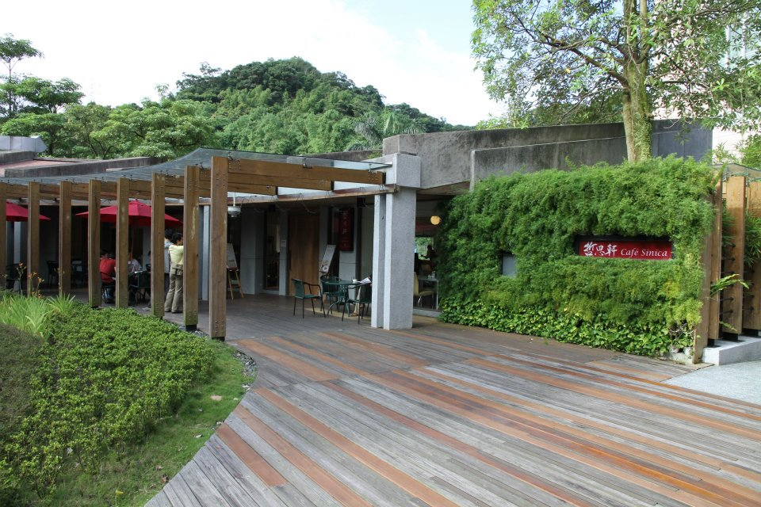
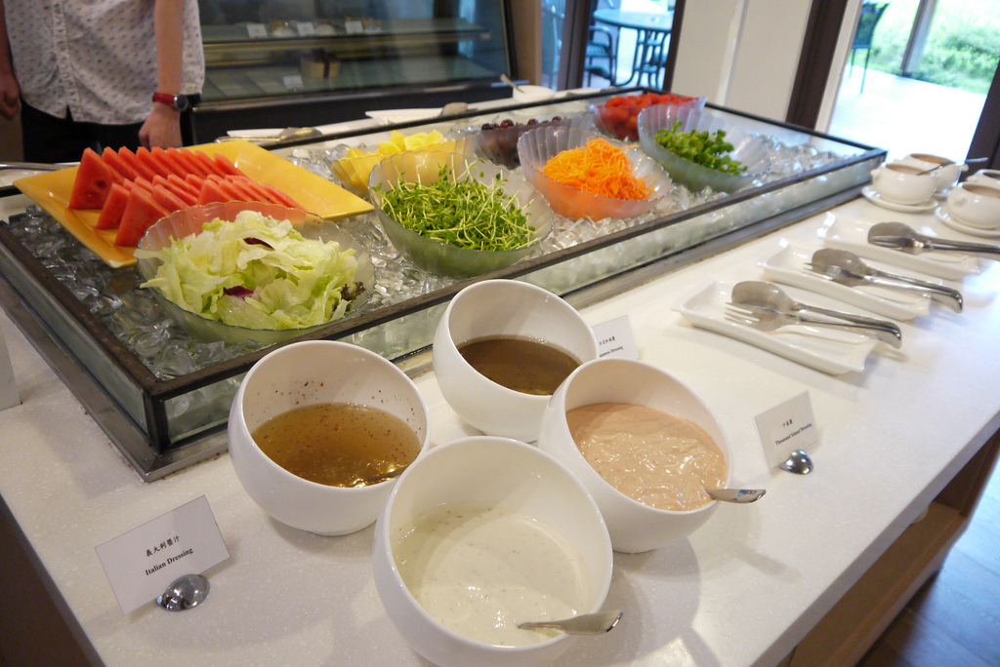
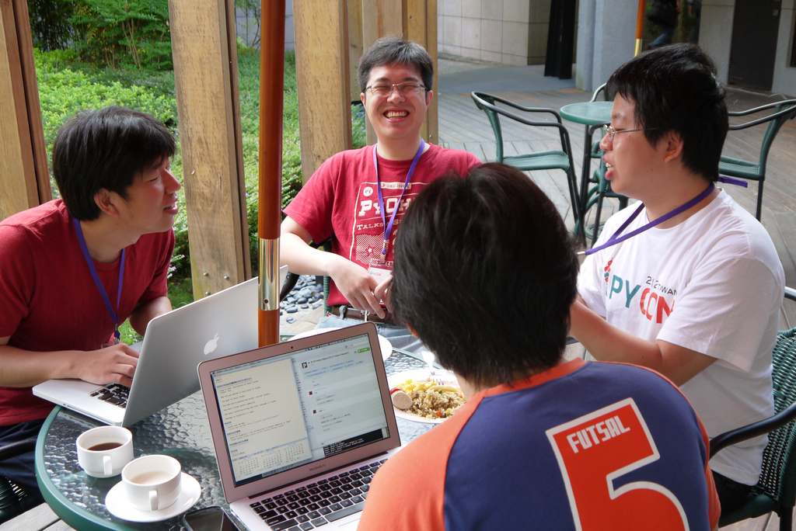
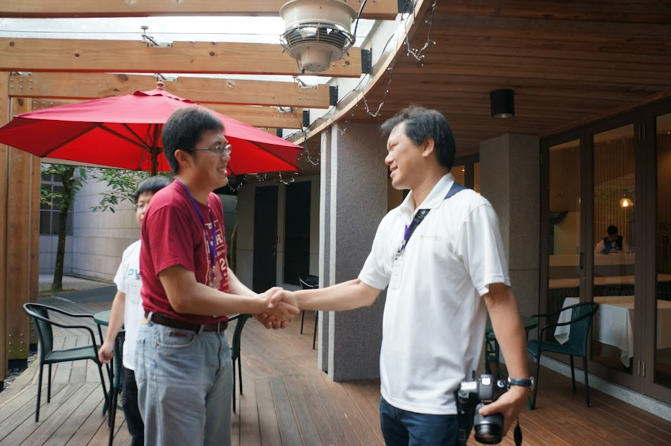
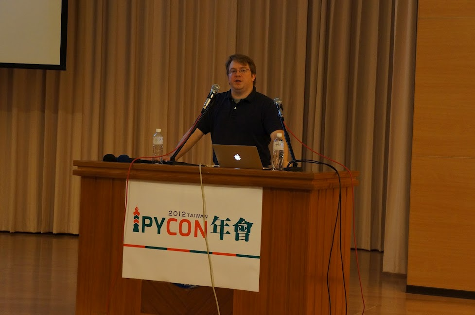
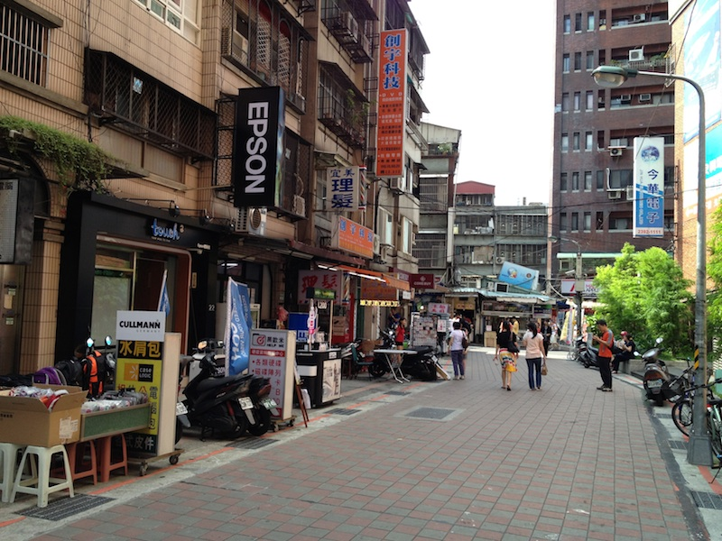
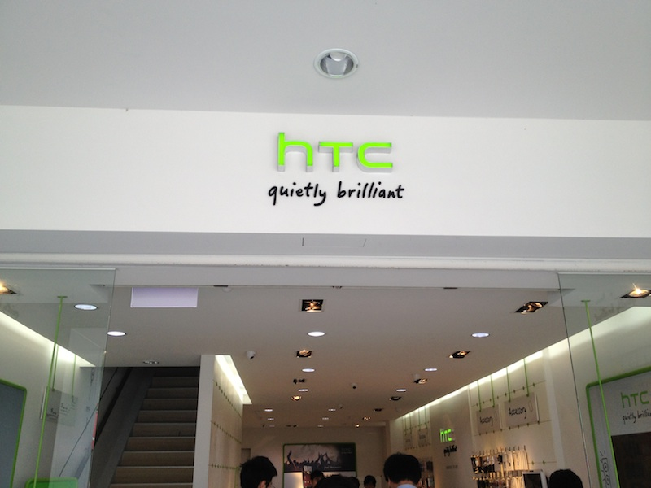
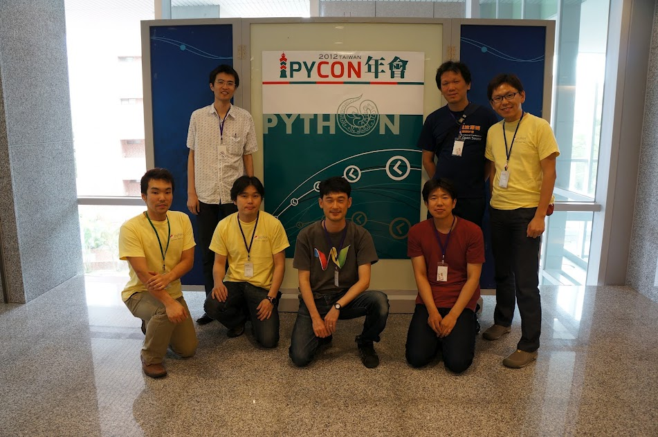

=======
 Day 2
=======

この日は `PyCon Taiwan 2012 <http://tw.pycon.org/2012/>`_ の2日目(最終日)です。
前日に宿泊した Center of Academic Activities(中央研究院學術活動中心)から一日がはじまりました。

朝食は宿泊施設に併設している `Cafe Sinica <http://sinica.howard-hotels.com/>`_ で食べました。緑に囲まれた素敵なカフェです。

   Cafe Sinica 外観

   朝食

PayCon Taiwanの運営者へのインタビュー
=====================================
鈴木たかのりです。
朝食後に Cafe の外で PyCon Taiwan の chairperson(座長)である
Yung-Yu Chen (`@yungyuc <http://twitter.com/yungyuc>`_)氏に時間をとってもらい、インタビューを行いました。
インタビューには PyCon Taiwan スタッフの Timtan 氏にも同席頂きました。

   インタビューに答える Yung-Yu Chen氏(奥)と Timtan氏(右)

- 今回、なぜ PyCon Taiwan を開催しようと思ったんですか?

  大きく2つの理由があります。

  1つ目は台湾で Python コミュニティを広く認知してもらいたいと思っているからです。
  台湾では多くの人が OSS コミュニティに関わったりしていますが、そのうち 1/10 くらいの人が python を使っていると思います。Java に比べると少ないのが現状です。

  2つ目の理由は Thinker [#]_ が 2011 に開催したアンカンファレンス [#]_ です。
  アンカンファレンスで Python についてのセッショんを呼びかけたところ 100 人程度が参加してくれました。
  2008年にも Python について呼びかけましたが、そのときは50〜70人が集まったと記憶しています。

  Python について話しをしたい人たちがいると感じたので、知り合いでミーティングを行い PyCon Taiwan の開催を決意しました。
  US で行われている PyCon のように Python に関わるいろいろな人達の出会いの場とな  ることを期待しています。

.. [#] Thinker: PyCon JP で日本にも来日して発表を行なった台湾の Python 開発者。このレポートの `Day 0 <http://gihyo.jp/news/report/01/pycon-taiwan2012/0000>`_ で Mozilla Taiwan で再会しました
.. [#] アンカンファレンス: (アンカンファレンスの説明)

- 今後 PyCon Taiwan が目指すゴールはどういったものですか?

  継続すること、より大きくなっていくことです。
  また、継続するためには主催者が燃え尽きないことが大事であると考えています。
  主催者は頑張り過ぎない必要があると思います。メンバーがお互い協力しあって会を運営する必要があると考えています。

  Python には "There's Only One Way To Do It." [#]_ というスローガンがありますが、これはプログラミングだけではなく PyCon イベントの進め方についても共通していると思います。
  (確かに、PyCon JP スタッフも同様のことを考えていると思いました)

  今後、PyCon Taiwan が Pythonic way [#]_ となることを期待してます。

.. [#] `TOOWTDI <http://wiki.python.org/moin/TOOWTDI>`_: 日本語に訳すと「やり方は一つしかない」といった意味になります。
   `There's More Than One Way To Do It. <http://d.hatena.ne.jp/keyword/TMTOWTDI>`_ という Perl のスローガンに対するジョークの応答して作られたそうですが、Python
   の性格を端的に表しています
.. [#] `The Zen of Python <http://www.python.jp/Zope/articles/misc/zen>`_
   に代表される python 的な考え方のことです

- 参加者とその内訳を教えてください

  全体で260名程度が参加登録してくれました。チケットの制限は250の予定でしたが最終的にこのようになりました。
  海外からの参加者は10〜15人程度だと思われます。また台湾在住のオーストラリアの方も参加してくれているようです。
  2つのスポンサーが今回つきましたが、スポンサーのボスも台湾人ではありません。

  スタッフは当日スタッフも含めて30名程度です。メインスタッフは5〜10人くらいのチームリーダーがいました。
  Peter はスポンサー企業のボスですが、もともと予定していた Keynote スピーカーが2週間前に病気にかかり急遽参加できなくなたときに、 Peter のつてで代役を無事探すことができました。

.. - How many participants(from taiwan, outside taiwan).

   - taiwan: 260(limit 250)
   - 10 to 15, 2 keynote, au or america live taiwan.
   - 2つのスポンサー企業のボスも台湾の人じゃないよー
   - staff: 30(当日スタッフとかも)メインスタッフは5 - 10くらいの team leader がいる
   - peter はスポンサーしてくれて: keynote スピーカーのこととか 2週間前に病気になって人変えたりとか手伝ってもらった

- 台湾の Python コミュニティについて教えてください

  台湾は Python を使用しているユーザは多いがコミュニティはありません。
  Python を使って仕事はしているが、メインのしごとは OSS やコンピュータサイエンスであるという人が多いです。
  今回の PyCon Taiwan をきっかけに Python ユーザの横のつながりができ、台湾の Python 事情が変わることを期待しています。

.. - How about Taiwan python community.
   - 水面下で動いている
   - taipei は python ユーザは多いけどコミュニティはない
   - python で仕事はしてるけど、メインは OSS やコンピュータサイエンスなのでpythonではない
   - python ユーザのつながりを作れたらいいなぁ
   - 20回ここでイベントやっている
   - python の人と話すのに飢えているので
   - PyCon Taiwan が変わるといいな
   - Numpy/Scipy 使っているけどコントリビュートは自分はできてない
   - taiwan にはspecific user group.
   - taiwan ユーザーグループは英語のユーザーグループに参加したりしているかも

- 最後の日本の Pythonista にメッセージをお願いします。

  "We love YOU and Python."

.. - How about python/perl/ruby and other language in Taiwan.
   - Message to Pythonista in Japan.

- どうもありがとうございました。

インタビューを終えた後も日本と台湾の PyCon 事情などについて歓談などをし、楽しい時間を過ごしました。早起きしてインタビューをした甲斐がありました。

   台湾と日本の PyCon 座長の握手

Keynote: Python and the Web
===========================
もりもとです。
2日目の基調講演は `James Tauber 氏 <http://jtauber.com/>`_ による、
Python と Web が歩んできた歴史について振り返るものでした。
彼は `Django <http://jtauber.com/django/>`_ のコア開発者であり `Pinax <http://jtauber.com/pinax/>`_ のリード開発者です。
1993年からオープンソース開発や Web の技術に携わり、1998年から Python を使っているそうです。

   James Tauber 氏

以下に彼の経歴や発表スライドが公開されています。

- `James Tauber 氏の経歴 <http://tw.pycon.org/2012/speaker/#james_tauber>`_
- `Slide: Python and the Web <http://www.slideshare.net/pycontw/python-and-the-web>`_

Python と Web
-------------

1990 年代からの Web と Python の発展、そのときに誕生した技術を順を追って紹介しました。
どこかで聞いたことがあるような、Knuth 博士の言葉も引用されていました。

  "Programs are meant to be read by humans and only incidentally for computers to execute" by Don Knuth

  "プログラムは人間が読めるように書かかれるものであり、たまたまコンピューターが実行できるに過ぎない"

Python に関しては、

- Zope/Plone
- WSGI
- MVC
- TurboGears

という技術動向の流れから最近の Web アプリケーションフレームワークに言及していました。

レイヤーの役割
--------------

上位レイヤーの移植性と下位レイヤーの再利用性について説明しながら Tim Peter 氏の言葉を引用しました。

  "We read Knuth so you don't have to" by Tim Peters [#f1]_

  "Knuth は我々が読んだ、あなたは読まなくて良い"

Knuth 博士が `The Art of Computer Programming <http://en.wikipedia.org/wiki/The_Art_of_Computer_Programming>`_  で、ソートと検索について、そのアルゴリズムや博士の技術的見解について800ページ近くのページを割いていますが、
Python ユーザーは、そういったことを気にしなくて良いという意図を表しています。

Python におけるソートのプラクティスは、
`ソート HOW TO <http://www.python.jp/doc/release/howto/sorting.html>`_ で
Decorate-Sort-Undecorate パターンとして紹介されています。

.. [#f1] `Familiar and Unfamiliar Quotations <http://norvig.com/quotations.html>`_

アイディアから具体化する
------------------------

Pinax は、Django 上に構築された、さらに上位のフレームワークで Django アプリを
より再利用しやすくしたり、どのサイトでも使うような共通処理を提供することを目的としています。
発表の中では、自分たちのサイトの特徴部分により注力して開発できると説明されていました。

  "What you do for a living is not be creative, what you do is ship" by Seth Godin [#f2]_

  "生活のためにやってることはクリエイティブではないから、そうなりたいならプロダクトをリリースしなさい"

.. [#f2] `Quieting the lizard brain <http://sethgodin.typepad.com/seths_blog/2010/01/quieting-the-lizard-brain.html>`_

.. python
   ------
   - pandas, music21, sphinx, PyPI, crate.io

   Web
   ---
   - HTML とかから
   - 画像
   - SSI, CGI
   - PHP
   - LAMP
   - Jabascript
   - JSON
   - github とかからAPIでとりだしてページを表示

   Python and web
   --------------
   - Zope/Plone: Full stack
   - WISG(ウィズギー): CGIっぽいやつ
     Pythonic way
   - Flask は小さいのにはいいけどね
   - Django: out of the box
   - Instagram, Pinterest

   最近4年Pinaxやっている

.. Pyjamas
.. =======
.. - Rasiel Chang
.. - `pyjamas - Python Web Widget Set and python-to-javascript compiler: make your own AJAX framework - Google Project Hosting <http://code.google.com/p/pyjamas/>`_
.. - python を書いて js と html を生成する GWT みたいなもの
.. - Single page のアプリケーションには向いているが、普通のweb pageには向いてない

.. toki
.. ====
.. - ネットワークゲームのログ解析とか分析のバックエンドについて
.. - Twisted, Django, MongoDB とか使ってる
.. - ログは Mongo DB に。スキーマないしログ形式の変更に柔軟に対応できる

.. Windows Azure
.. =============
.. - Windows Azure 上で Python で開発できるよ

Welcome To PyCon JP
===================
鈴木たかのりです。
さて、2日目のランチの前にはいよいよ PyCon JP スタッフの
`保坂 翔馬 <http://twitter.com/shomah4a>`_ による発表です。
タイトルの通り「PyCon JP へようこそ」と題して、2012年の9月に開催される
`PyCon JP 2012 <http://2012.pycon.jp/>`_ の紹介を行いました。

.. figure:: /_static/shoma.jpg
   :width: 320
   :alt: 保坂 翔馬さん
   
   PyCon JP を代表して発表を行う保坂 翔馬さん

以下に発表スライドと清水川さんが撮影したビデオが公開されています。

- `Welcome to PyCon JP <http://shomah4a.net/pycontw_slide/>`_
- `Welcome To PyCon JP - YouTube <http://www.youtube.com/watch?v=lSjzUc9GhbQ>`_

`Day 1 のランチの時に <http://gihyo.jp/news/report/01/pycon-taiwan2012/0001?page=4>`_
保坂さんは台湾の人に「中国語でどんな挨拶したらいいですかね」と聞いて教えてもらって録音もしていたんですが、やはり初めての中国語で長文は難しかったようで、つかみの挨拶は「英語+謝謝」だけになってしまいました。それでも参加者のみなさんからのたくさんの拍手をもらって、非常に暖かい聴衆だなと感じました。

発表の内容としては `PyCon JP 2011 <http://2011.pycon.jp>`_ の実績紹介と `PyCon JP 2012`_ の概要説明について話しをしていました。
資料やビデオを見てもらうとわかりますが、いくつか笑ってもらうポイントを入れていました。だいたい想定通りにウケていて、リハーサルをやってみんなで資料にツッコミ入れていた甲斐がありました。

.. _`PyCon JP 2012`: http://2012.pycon.jp/

また、日本からの参加メンバーの紹介では一人ひとり立って挨拶して拍手をもらったりして、ちょっと気恥ずかしかったですが、うれしくもありました。

この発表を行った成果だと思いますが、先日終了した演題募集には台湾からも数名が申し込んでくれたようです。PyCon JP 2012 当日にも台湾をはじめ、世界中から Pythonista が集まって相互に交流できることを楽しみにしています。

.. figure:: /_static/more-people.jpg
   :width: 320
   :alt: More pople joins from Taiwan
   
   More pople joins from Taiwan

また、来年の PyCon Taiwan をはじめ海外の PyCon 等のイベントに、どんどん日本からも発表をしに行ってほしいと感じました。と偉そうに書いてますが、私も英語発表をやったことはないんですが。

.. PyKinect
.. ========
.. - ericsk
.. - Kinect for Windows
.. - PyKinect How-to
.. - References

.. CyberLink Meets Python
.. ======================
.. - Honder Tzou

.. QtQuick GUI Programming with PySide
.. ===================================
.. - Garylee
.. - `Qt Quick <http://qt.nokia.com/products-jp/qt-quick/>`_
.. - Qt ベース
.. - QMLで定義
.. - Qt Designerとか
.. - PySide
.. - PySide v.s. PyQt

What Can Meta Class Do For You?
===============================
鈴木たかのりです。

`What can meta class do for you? <http://www.slideshare.net/hychen/what-can-meta-class-do-for-you-pycon-taiwan-2012>`_

- hychen
- Singleton, Countable, Class Verification などの例を使って Meta Class プログラミングについて説明

Closing
=======
Closing ではまず最初に20名程度の PyCon Taiwan スタッフが壇上に上がり、拍手で讃えられました。

次はお待ちかねのプレゼントタイムです。
PyLottery という `PyGame <http://www.pygame.org/news.html>`_ を使用したプログラムで、PyCon Taiwan ロゴの蛇がボールを食べると番号が表示されるという抽選プログラムを使用しました。
PyLottery のソースコードは
`yungyuc / pylottery / overview — Bitbucket <https://bitbucket.org/yungyuc/pylottery>`_
で公開されています。

.. figure:: /_static/pylottery.jpg
   :width: 320
   :alt: PyLottery
   
   PyLottery

抽選で当たった人は PyCon Taiwan Tシャツなどをもらっていましたが、日本からおみやげみ持っていった手ぬぐいやTシャツなどもプレゼントとして使用されました。
受け取った人が喜んでくれるといいんですが。

.. figure:: /_static/bushido.jpg
   :width: 320
   :alt: 武士道Tシャツもプレゼント
   
   武士道Tシャツもプレゼント

最後に、会期中に撮影した写真で作成されたスライドショーを表示して、2日間に渡った PyCon Taiwan 2012 は成功のうちに終了しました。

.. figure:: /_static/slideshow.jpg
   :width: 320
   :alt: スライドショー
   
   スライドショー

Dinner
======

台北電脳街
==========
もりもとです。
私は飛行機の時間の関係でランチ後には PyCon Taiwan の会場を後にしました。
そして、飛行場に行く前に少し寄り道(観光)をしました。

`MRT <http://ja.wikipedia.org/wiki/台北捷運>`_ という台北の地下鉄に乗り、
`忠孝新生駅 <http://ja.wikipedia.org/wiki/忠孝新生駅>`_ を降りるとすぐに電気街があります。
日本の秋葉原に相当する場所のようですが、規模はあまり大きくありません。
小さな PC パーツショップや量販店が並んでいました。

   電脳街の一角

保坂さんは、HTC ショップでスマートフォン端末を購入しました。せっかく台湾へ来たので現地で購入するのも楽しいですね。

   HTC ショップ

   購入した HTC 端末

PyCon JP 2012のお知らせ
=======================
鈴木たかのりです。

私もスタッフとして参加している
`PyCon JP 2012`_
が開催されます。今年は期間、参加人数共に規模を拡大して開催します。

:カンファレンス: 2012-09-15(土)-16(日)
:Sprint: 2012-09-17(月・祝)
:テーマ: つながるPython/Python Connect
:会場: `産業技術大学院大学 <http://2012.pycon.jp/venue.html>`_
:参加者数(予定): 400
:運営: `PyCon JP 実行委員会 <http://www.pycon.jp/committee.html>`_
       PyCon JP 2012 運営チーム

現在、演題の募集(Call for Proposals)を締め切り選定作業を行なっているところです。
また、キーノートスピーカーにはマイクロフレームワーク
`Flask <http://flask.pocoo.org/>`_
の開発で知られる
`Armin Ronacher <http://2012.pycon.jp/program/keynote.html>`_ 氏を迎えます。

まもなくチケットの発売を開始しますので、スケジュールを空けて待っていてください。
日本のみならず、台湾や他の国から多数の Python 開発者が一同に介する会になると思います。当日、楽しく有意義な時間を過ごせるように、準備を進めています。

では、PyCon JP 2012 でお会いしましょう!!

