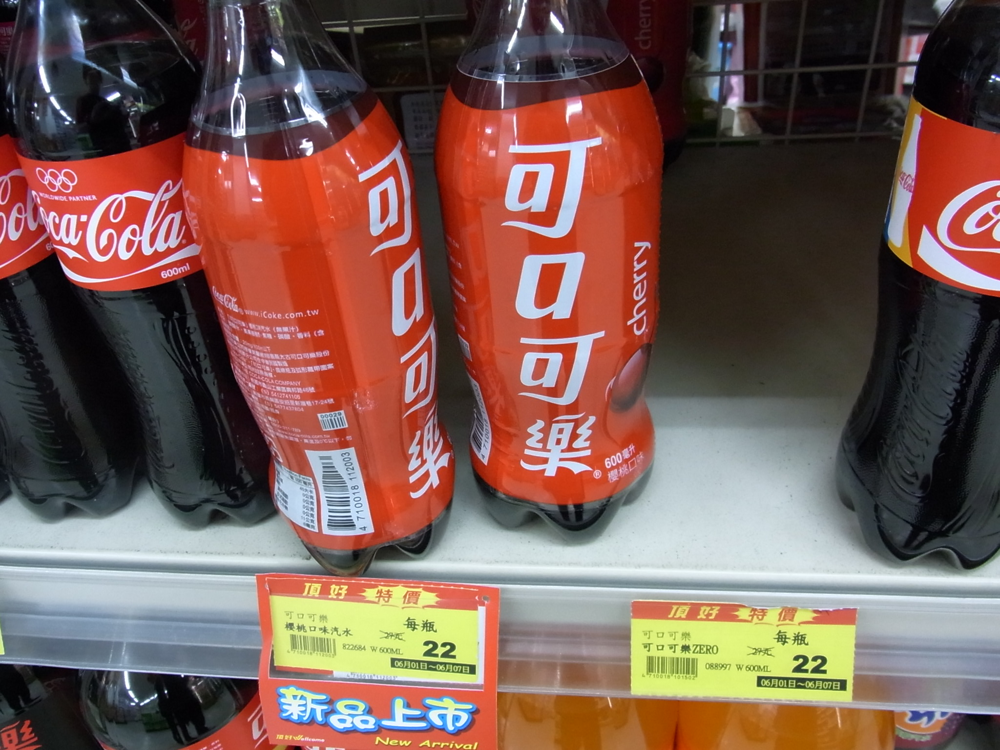
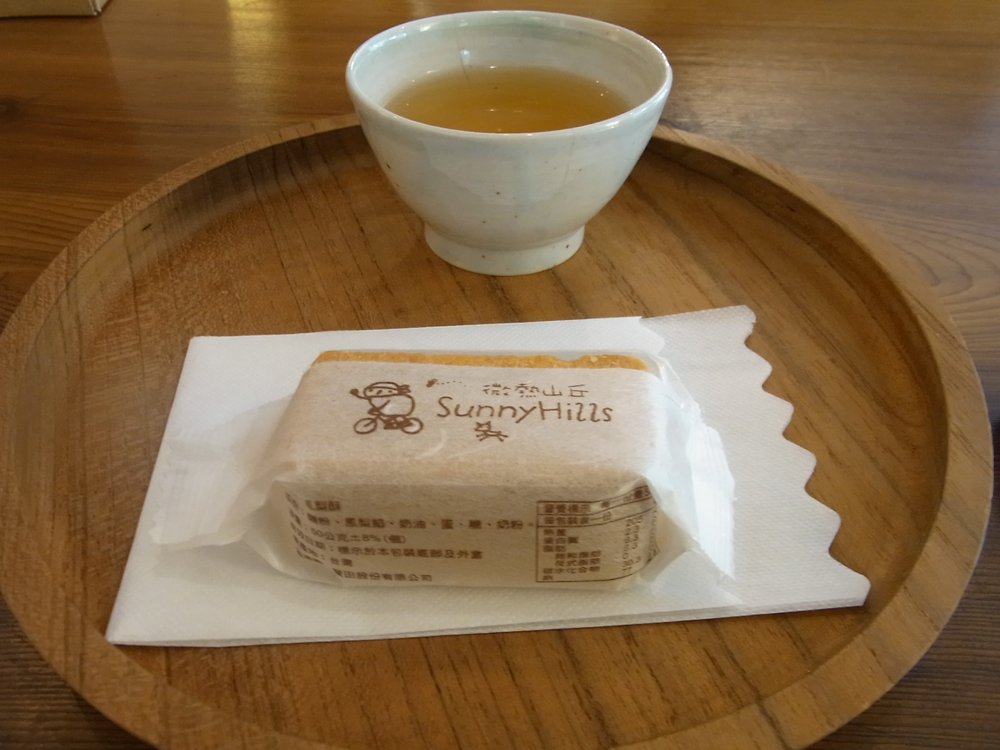

=======
 Day 2
=======

`PyCon Taiwan 2012 <http://tw.pycon.org/2012/>`_ レポートは今回が最終回です。
2日目(最終日)のこの日は、前日に宿泊した Center of Academic Activities(中央研究院學術活動中心)から一日がはじまりました。

朝食は宿泊施設に併設している `Cafe Sinica <http://sinica.howard-hotels.com/>`_ で食べました。
緑に囲まれた素敵なカフェで、普通にホテルの朝食という感じでした。

   Cafe Sinica 外観

.. figure:: _static/breakfast.jpg
   :width: 320
   :alt: ホテルっぽい朝食

   ホテルっぽい朝食

PayCon Taiwanの運営者へのインタビュー
=====================================
鈴木たかのりです。
朝食後に Cafe の外で PyCon Taiwan の chairperson(座長)である
Yung-Yu Chen (`@yungyuc <http://twitter.com/yungyuc>`_)氏に時間をとってもらい、私ともりもとさんでインタビューを行いました。
インタビューには PyCon Taiwan スタッフの Timtan 氏にも同席頂きました。

.. figure:: _static/interview.jpg
   :width: 320
   :alt: インタビューの様子

   インタビューに答える Yung-Yu Chen氏(奥)と Timtan氏(右)

- 今回、初めての PyCon Taiwan を開催しようと思った理由を教えて下さい。

  大きく2つの理由があります。

  1つ目は台湾で Python コミュニティを広く認知してもらいたいと思っているからです。
  台湾では多くの人が OSS コミュニティに関わっていますが、そのうち 1/10 くらいの人が Python を使っていると思います。Java に比べると少ないのが現状です。

  2つ目の理由は Thinker [#]_ が 2011 に開催したアンカンファレンス [#]_ です。
  アンカンファレンスで Python についてのセッションを開催したところ 100 人程度が参加してくれました。
  2008年にも Python について呼びかけましたが、そのときは50人強が集まったと記憶しています。

  Python について話したい開発者がいると感じたので、数人でミーティングを行い PyCon Taiwan の開催を決意しました。
  US で行われている `PyCon <http://us.pycon.org/>`_ のように Python に関わるいろいろな人達の出会いの場とな  ることを期待しています。

- PyCon Taiwan の今後の目標を教えて下さい。

  まずは継続すること、そしてより大きくなっていくことです。
  また、会を継続するためには主催者が燃え尽きないことが大事であると考えています。
  主催者は頑張り過ぎない必要があると思います。メンバーがお互い協力しあって会を運営する必要があると考えています。

  Python には "There's Only One Way To Do It." [#]_ というスローガンがありますが、これはプログラミングだけではなく PyCon イベントの進め方についても共通していると思います。
  (確かに、PyCon JP スタッフも同様のことを考えていると思いました)

  今後、PyCon Taiwan が Pythonic way [#]_ となることを期待してます。

- 参加者とその内訳はどのようになっていますか。

  全体で260名程度が参加登録してくれました。チケットの制限は250の予定でしたが最終的にこのようになりました。
  海外からの参加者は(日本も含めて)10〜15人程度だと思われます。また台湾在住のオーストラリア、アメリカの方も参加してくれているようです。
  2つのスポンサーが今回つきましたが、各スポンサーの社長も台湾人ではありません。

  スタッフは当日スタッフも含めて30名程度です。メインスタッフは5〜10人くらいのチームリーダーがいました。
  チームリーダーではなくても活発に活動してくれているスタッフもいます。スポンサー企業の社長でもある Peter はスタッフも努めてくれています。彼は、もともと予定していた Keynote スピーカーが2週間前に病気にかかり急遽参加できなくなったときに、代役を探してくれました。

.. - How many participants(from taiwan, outside taiwan).

   - taiwan: 260(limit 250)
   - 10 to 15, 2 keynote, au or america live taiwan.
   - 2つのスポンサー企業のボスも台湾の人じゃないよー
   - staff: 30(当日スタッフとかも)メインスタッフは5 - 10くらいの team leader がいる
   - peter はスポンサーしてくれて: keynote スピーカーのこととか 2週間前に病気になって人変えたりとか手伝ってもらった

- 台湾の Python コミュニティについて教えてください。

  台湾は Python を使用しているユーザは多いのですが、コミュニティはありません。
  Python を使って仕事はしているが、メインの仕事は OSS やコンピュータサイエンスであるという人が多いようです。
  今回の PyCon Taiwan をきっかけに Python ユーザの横のつながりができ、台湾の Python 事情が変わることを期待しています。

.. - How about Taiwan python community.
   - 水面下で動いている
   - taipei は python ユーザは多いけどコミュニティはない
   - python で仕事はしてるけど、メインは OSS やコンピュータサイエンスなのでpythonではない
   - python ユーザのつながりを作れたらいいなぁ
   - 20回ここでイベントやっている
   - python の人と話すのに飢えているので
   - PyCon Taiwan が変わるといいな
   - Numpy/Scipy 使っているけどコントリビュートは自分はできてない
   - taiwan にはspecific user group.
   - taiwan ユーザーグループは英語のユーザーグループに参加したりしているかも

- 最後の日本の Pythonista にメッセージをお願いします。

  "We love YOU and Python."

.. - How about python/perl/ruby and other language in Taiwan.
   - Message to Pythonista in Japan.

- どうもありがとうございました。

インタビューを終えた後も日本と台湾の PyCon 事情などについて歓談などをし、楽しい時間を過ごしました。早起きしてインタビューをした甲斐がありました。

.. figure:: _static/shake-hands.jpg
   :width: 320
   :alt: 台湾と日本の PyCon 座長の握手

   台湾と日本の PyCon 座長の握手

.. [#] Thinker: PyCon JP で日本にも来日して発表を行なった台湾の Python 開発者。このレポートの `Day 0 <http://gihyo.jp/news/report/01/pycon-taiwan2012/0000>`_ で Mozilla Taiwan で再会しました
.. [#] アンカンファレンス: あらかじめ発表内容が決まっている通常のセッションとは異なり、参加者自身がテーマを出してセッションを作り上げていくものです。似たような形式にオープンスペースというものがあります。
.. [#] `TOOWTDI <http://wiki.python.org/moin/TOOWTDI>`_: 日本語に訳すと「やり方は一つしかない」といった意味になります。
   `There's More Than One Way To Do It. <http://d.hatena.ne.jp/keyword/TMTOWTDI>`_ という Perl のスローガンに対するジョークの応答して作られたそうですが、Python
   の性格を端的に表しています
.. [#] `The Zen of Python <http://www.python.jp/Zope/articles/misc/zen>`_
   に代表される python 的な考え方のことです

Keynote: Python and the Web
===========================
もりもとです。
2日目の基調講演は `James Tauber <http://jtauber.com/>`_ 氏による、
Python と Web が歩んできた歴史について振り返るものでした。
彼は `Django <http://jtauber.com/django/>`_ のコア開発者であり `Pinax <http://jtauber.com/pinax/>`_ のリード開発者です。
1993年からオープンソース開発や Web の技術に携わり、1998年から Python を使っているそうです。

.. figure:: _static/james_tauber.jpg
   :width: 320
   :alt: James Tauber 氏

   James Tauber 氏

以下に彼の経歴や発表スライドが公開されています。

- `James Tauber 氏の経歴 <http://tw.pycon.org/2012/speaker/#james_tauber>`_
- `Slide: Python and the Web <http://www.slideshare.net/pycontw/python-and-the-web>`_

Python と Web
-------------

1990 年代からの Web と Python の発展、そのときに誕生した技術を順を追って紹介しました。
どこかで聞いたことがあるような、Knuth 博士の言葉も引用されていました。

  "Programs are meant to be read by humans and only incidentally for computers to execute" by Don Knuth

  "プログラムは人間が読めるように書かかれるものであり、たまたまコンピューターが実行できるに過ぎない"

Python に関しては、

- Zope/Plone
- WSGI
- MVC
- TurboGears

という技術動向の流れから最近の Web アプリケーションフレームワークに言及していました。

レイヤーの役割
--------------

上位レイヤーの移植性と下位レイヤーの再利用性について説明しながら Tim Peter 氏の言葉を引用しました。

  "We read Knuth so you don't have to" by Tim Peters [#f1]_

  "Knuth は我々が読んだ、あなたは読まなくて良い"

Knuth 博士が `The Art of Computer Programming <http://en.wikipedia.org/wiki/The_Art_of_Computer_Programming>`_  で、ソートと検索について、そのアルゴリズムや博士の技術的見解について800ページ近くのページを割いていますが、
Python ユーザーは、そういったことを気にしなくて良いという意図を表しています。

Python におけるソートのプラクティスは、
`ソート HOW TO <http://www.python.jp/doc/release/howto/sorting.html>`_ で
Decorate-Sort-Undecorate パターンとして紹介されています。

.. [#f1] `Familiar and Unfamiliar Quotations <http://norvig.com/quotations.html>`_

アイディアから具体化する
------------------------

Pinax は、Django 上に構築されたさらに上位のフレームワークで、
Django アプリをより再利用しやすくしたり、どのサイトでも使うような共通処理を提供することを目的としています。
発表の中では、自分たちのサイトの特徴部分により注力して開発できると説明されていました。

  "What you do for a living is not be creative, what you do is ship" by Seth Godin [#f2]_

  "生活のためにやってることはクリエイティブではないから、そうなりたいならプロダクトをリリースしなさい"

PyCon Japan では Web 系の発表が多いですが、PyCon Taiwan では科学系や研究系の発表が多かったです。
私が初日の基調講演の配列指向 (array-oriented) という概念が興味深かったように、
非 Web 開発系の参加者にとっては、Web の要素技術の変遷が新鮮だったのかもしれません。

.. [#f2] `Quieting the lizard brain <http://sethgodin.typepad.com/seths_blog/2010/01/quieting-the-lizard-brain.html>`_

.. python
   ------
   - pandas, music21, sphinx, PyPI, crate.io

   Web
   ---
   - HTML とかから
   - 画像
   - SSI, CGI
   - PHP
   - LAMP
   - Jabascript
   - JSON
   - github とかからAPIでとりだしてページを表示

   Python and web
   --------------
   - Zope/Plone: Full stack
   - WISG(ウィズギー): CGIっぽいやつ
     Pythonic way
   - Flask は小さいのにはいいけどね
   - Django: out of the box
   - Instagram, Pinterest

   最近4年Pinaxやっている

.. Pyjamas
.. =======
.. - Rasiel Chang
.. - `pyjamas - Python Web Widget Set and python-to-javascript compiler: make your own AJAX framework - Google Project Hosting <http://code.google.com/p/pyjamas/>`_
.. - python を書いて js と html を生成する GWT みたいなもの
.. - Single page のアプリケーションには向いているが、普通のweb pageには向いてない

.. toki
.. ====
.. - ネットワークゲームのログ解析とか分析のバックエンドについて
.. - Twisted, Django, MongoDB とか使ってる
.. - ログは Mongo DB に。スキーマないしログ形式の変更に柔軟に対応できる

.. Windows Azure
.. =============
.. - Windows Azure 上で Python で開発できるよ

Welcome To PyCon JP
===================
鈴木たかのりです。
さて、2日目のランチの前にはいよいよ PyCon JP スタッフの
`保坂 翔馬 <http://twitter.com/shomah4a>`_ 氏による発表です。
タイトルの通り「PyCon JP へようこそ」と題して、2012年の9月に開催される
`PyCon JP 2012`_ の紹介を行いました。

.. figure:: /_static/shoma.jpg
   :width: 320
   :alt: 保坂 翔馬 氏
   
   PyCon JP を代表して発表を行う保坂 翔馬さん

以下に発表スライドと清水川さんが撮影したビデオが公開されています。

- `Welcome to PyCon JP <http://shomah4a.net/pycontw_slide/>`_
- `Welcome To PyCon JP - YouTube <http://www.youtube.com/watch?v=lSjzUc9GhbQ>`_

実は、
`Day 1 のランチの時に <http://gihyo.jp/news/report/01/pycon-taiwan2012/0001?page=4>`_
保坂さんは「中国語でどんな挨拶したらいいですかね」と Taiwan スタッフに聞いて教えてもらい録音もしていました。しかし、初めての中国語で長文は難しかったようで、つかみの挨拶は「英語+謝謝(ありがとう)」だけになってしまいました。
それでも参加者のみなさんからのたくさんの拍手をもらい、非常に暖かい雰囲気で発表が始まりました。

発表の内容としては `PyCon JP 2011`_ の実績紹介と `PyCon JP 2012`_ の概要説明について話しをしていました。
資料やビデオを見てもらうとわかりますが、いくつか笑ってもらうポイントを入れていました。だいたい想定通りにウケていて、リハーサルでいろいろな人に発表にツッコミを入れてもらった甲斐があったと思います。
また、日本からの参加メンバーの紹介では一人ひとり立って挨拶して拍手をもらったりして、ちょっと気恥ずかしかったですが、うれしくもありました。

.. _`PyCon JP 2012`: http://2012.pycon.jp/
.. _`PyCon JP 2011`: http://2011.pycon.jp/

この発表を行った成果だと思いますが、先日終了した演題募集(Call for Proposals)には台湾からも数名が申し込んでくれたようです。PyCon JP 2012 当日にも台湾をはじめ、世界中から Pythonista が集まって相互に交流できることを楽しみにしています。

.. figure:: /_static/more-people.jpg
   :width: 320
   :alt: More pople joins from Taiwan
   
   More pople joins from Taiwan

また、来年の PyCon Taiwan をはじめ海外の PyCon 等のイベントに、どんどん日本からも発表をしに行ってほしいと感じました。と偉そうに書いてますが、私も海外で発表をやったことはないんですが。

.. PyKinect
.. ========
.. - ericsk
.. - Kinect for Windows
.. - PyKinect How-to
.. - References

.. CyberLink Meets Python
.. ======================
.. - Honder Tzou

.. QtQuick GUI Programming with PySide
.. ===================================
.. - Garylee
.. - `Qt Quick <http://qt.nokia.com/products-jp/qt-quick/>`_
.. - Qt ベース
.. - QMLで定義
.. - Qt Designerとか
.. - PySide
.. - PySide v.s. PyQt

What Can Meta Class Do For You?
===============================
鈴木たかのりです。
ここでは大トリの What Can Meta Class Do For You? というメタクラスに関するセッションについて紹介します。発表者の hychen 氏は
`PyCon JP 2011 での発表 <http://2011.pycon.jp/program/talks#hsin-yi-chen-hychen>`_ や、
`前日の Lightning Talks <http://gihyo.jp/news/report/01/pycon-taiwan2012/0001?page=3>`_
でも発表を行うなど、Taiwan の Python 界を引っ張っている存在のように感じました。

.. figure:: /_static/hychen.jpg
   :width: 320
   :alt: hychen 氏
   
   hychen 氏

以下に hychen 氏の発表スライドが公開されています。

- `What can meta class do for you? <http://www.slideshare.net/hychen/what-can-meta-class-do-for-you-pycon-taiwan-2012>`_

発表内容はいくつかの例題をメタクラスで実装したサンプルを示して、メタクラス入門といった感じのセッションとなりました。
最初に概念として Class が Type のインスタンスであることを説明し、Type の代わりに **__metaclass__** に任意のクラスを指定することによって、クラスのふるまいを変えることができるということを解説しました。
次に応用例として、メタクラスを使用してどんなプログラミングができるかを示していました。

最初の例では `Singleton パターン <http://ja.wikipedia.org/wiki/Singleton_%E3%83%91%E3%82%BF%E3%83%BC%E3%83%B3>`_ をメタクラスで実装しました。
以下のようなデータベース接続するための Class があります。

.. code-block:: python

   class MySQL(object):
       session_max = 1000
       __metaclass__ = Singleton
       def __init__(self):
           print 'connecting to {0}.format(self.session_max)

この MySQL Class はいくつインスタンスを作成しても、全て同じインスタンスとなります。

.. code-block:: python

   >>> db1 = MySQL()
   >>> print id(db1)
   >>> db2 = MySQL()
   >>> print id(db1)
   >>> db3 = MySQL()
   >>> print id(db1)

Singleton メタクラスは以下のようなコードで定義されています。
こうすることにより、あるクラスに Singleton パターンを適用したい場合には ``__metaclass__ = Singleton`` と記述するだけで実現できるようになります。

.. code-block:: python

   class Singleton(type):
       def __init__(cls, name, bases, dic):
           super(Singleton, cls).__init__(name, bases, dic)
	   cls.instance = None
       def __call__(cls, *args, **kwargs):
           print "please use get_instance fanctuin to get the instance"
	   return cls.get_instance(*args, **kwargs)
       def get_instance(cls, *args, **kw):
           if cls.instance == None:
	       cls.instance = super(Singleton, cls).__call__(*args, **kw)
           return cls.instance

他にもいくつかのメタプログラミングの例が示されているのでスライドを参照してみてください。
まとめとしてメタプログラミングでできることはたくさんある(無量大数という表現を使っていました)ということを説明していました。
メタプログラミングはコードが簡潔になるという反面、なにが行われているかわかりにくく、理解するのが簡単ではないと語られていました。

.. figure:: /_static/muryotaisu.jpg
   :width: 320
   :alt: 可能性は無量大数
   
   可能性は無量大数

最後に Python 開発者の `Shalabh Chaturvedi <http://www.shalabh.com/>`_ 氏の以下の言葉を引用して終わりました。なかなか深い言葉です。

- Q: いつメタクラスを使用するべきですか?
- A: その時は決して来ません(この質問をしている間は)

私にもなんとなくメタクラスのポイントがわかる、とてもよい発表でした。

Closing
=======
2日間に渡る PyCon Taiwan が閉会の時を迎えました。
Closing ではまず最初に PyCon Taiwan スタッフが壇上に上がり、拍手で讃えられました。

次はお待ちかねのプレゼントタイムです。
PyLottery という `PyGame <http://www.pygame.org/news.html>`_ を使用したプログラムで、PyCon Taiwan ロゴの蛇がボールを食べると番号が表示されるという抽選を行いました。
なお、PyLottery のソースコードは
`yungyuc / pylottery / overview — Bitbucket <https://bitbucket.org/yungyuc/pylottery>`_
で公開されています。

.. figure:: /_static/pylottery.jpg
   :width: 320
   :alt: PyLottery
   
   PyLottery

抽選で当たった人は PyCon Taiwan Tシャツなどをもらっていました。また、日本からおみやげとして持参した手ぬぐいやTシャツなどもプレゼントとして使用されました。
受け取った人が喜んでくれるといいんですが。

.. figure:: /_static/bushido.jpg
   :width: 320
   :alt: 武士道Tシャツをプレゼント
   
   武士道Tシャツをプレゼント

最後に、会期中に撮影した写真で作成されたスライドショーを表示して、2日間に渡った PyCon Taiwan 2012 は成功のうちに終了しました。

.. figure:: /_static/slideshow.jpg
   :width: 320
   :alt: スライドショー
   
   スライドショー

Dinner
======
鈴木たかのりです。
他のメンバーは飛行機の関係で午後には会場をあとにしていました。
Closing まで残っていた私と西本さんは
Taiwan スタッフの誘いを受けて Dinner Party にご一緒させてもらいました。
場所は宿泊施設と同じ建物にあるレストラン金華樓です。

テーブルはいわゆる「ぐるぐるまわる」中華料理のテーブルですが、台湾人の彼らが言うには「伝統的なスタイルの中華料理」らしく、どちらかと言うと珍しいものだそうです。
言われてみれば、街なかで見た中華料理屋は四角いテーブルの店が多かったように感じました。

   中華料理

料理はなかなかレベルが高く、おいしくいただきました。
台湾の方はあまりお酒は飲まないようで、日本人二人と日本に住んでいたことのある女性スタッフと三人だけがビールを飲んでいました。
彼女は「また日本に行くことがあれば、ビールと焼き鳥を食べたい」と言っていました。PyCon JP に来たら是非おいしい焼き鳥に誘いたいと思います。

英語、中国語、日本語で楽しく会話をしながらおいしい食事を食べ、私の PyCon Taiwan 2012 参加は幕を閉じました。

   PyCon Taiwan スタッフとの会食

台北電脳街
==========
もりもとです。
私は飛行機の時間の関係でランチ後には PyCon Taiwan の会場を後にしました。
そして、飛行場に行く前に少し寄り道(観光)をしました。

`MRT <http://ja.wikipedia.org/wiki/台北捷運>`_ という台北の地下鉄に乗り、
`忠孝新生駅 <http://ja.wikipedia.org/wiki/忠孝新生駅>`_ を降りるとすぐに電気街があります。
日本の秋葉原に相当する場所のようですが、規模はあまり大きくありません。
小さな PC パーツショップや量販店が並んでいました。

.. figure:: _static/electric_city.jpg 
   :width: 320
   :alt: 電脳街の一角

   電脳街の一角

保坂さんは、HTC ショップでスマートフォン端末を購入しました。せっかく台湾へ来たので現地で購入するのも楽しいですね。

.. figure:: _static/htc.jpg 
   :width: 320
   :alt: HTC ショップ

   HTC ショップ

.. figure:: _static/htc_device.jpg
   :height: 320
   :alt: 購入した HTC 端末

   購入した HTC 端末

台湾の旅終了
============
再び、鈴木たかのりです。
私は Dinner を終えてからホテルに戻り、次の日におみやげなどの買い物をして帰国しました。台湾をぶらついていくつか面白かったところを紹介します。

ホテル近くのスーパーで買い物する時に漢字のコカ・コーラを見つけました。
雑誌とかで見たことはありましたが、実物を見るのは初めてでした。

   コカ・コーラは可口可楽

   ペプシ・コーラは百事可楽

台北駅(台北車站)は日本で言うと東京駅にあたるような駅で、駅舎は非常に立派でした。
中は吹き抜けになっており、乗車券の発売窓口が並んでいます。
また、一階、二階には多数のショップが並んでいるんですが、見たことのある店たくさん入っていて「ここは本当に台湾なんだろうか?」という錯覚を覚えました。

   台北駅の吹き抜け

   台北駅の中のショップ(一部)

   らあめん花月嵐

   ごはん処 大戸屋

お昼ごはんはここまで色々食べまくっていたので、質素にデパートの地下フードコートで食べました。50台湾ドル(約140円)ですが軽めの食事としては十分な量でした。

   ミーフン

次の写真は MRT の駅にあった化粧品の広告です。日本のメーカーでモデルが菅野美穂さんなのはいいんですが、コピーに「一見傾心の輕齢美肌」と書いてあり日本語としては意味不明です。中国語だとしたら「の」はみんな読めるのか?と不思議に思いました。

   化粧品の広告

Dinner のときに台湾スタッフに「おすすめのお土産ありますか?」と聞いたところ、
`SunnyHills(微熱山丘) <http://www.sunnyhills.com.tw/>`_
を紹介されたので行って来ました。
場所は松山空港から徒歩15分くらいで、他にはあまり何もないようなところです。
ネットで調べたところ、通常のパイナップルケーキは餡に冬瓜などが混ざっているそうですが、このお店はパイナップル100%でできているのがおいしさのポイントだそうです。

空港で荷物をコインロッカーに入れて、歩いてお店に向かいました。
席に案内されるとパイナップルケーキが1つ試食で提供されます。ちょっとお高いんですが、噂通りにおいしいのでおみやげに購入しました。地元っぽい人が沢山買っていったし、空港でチェックインするときにも職員の人が「これおいしいんですよね」と言っていたので、ずいぶん人気なんだなぁと思いました。台湾に行かれる方にはおすすめのお土産です。

   Sunny Hills の看板

   パイナップルケーキ

パイナップルケーキを買って空港に戻って来ました。
空港内のセブン・イレブンには大きな人形が飾ってあります。
このキャラクターは
`OPEN小將 <http://www.openopen.com.tw/>`_ (OPENちゃん)といって台湾セブン・イレブンのキャラクターのようです。
個人的にはなかなかかわいいキャラクターで気に入りました。
携帯ストラップなど各種グッズが作られているようですが、写真の台湾の名所ストラップは「どこも行ってないなぁ...」と思い購入を断念しました。

   空港内のセブン・イレブン

   OPENちゃんストラップ

2日目に使った現金は Academia Sinica のホテル代だけでした。
3日目はおもにおみやげに使い、空港内で無駄に頑張って台湾ドルを全部使い切ることができました(EasyCardのチャージが残ってますが...)。
こうして、私の PyCon Taiwan の旅が終わりました。

.. figure:: _static/receipt.jpg
   :height: 320
   :alt: 最後の90台湾ドルを支払ったレシート

   最後の90台湾ドルを支払ったレシート

.. list-table::
   :header-rows: 1
   :widths: 40 40 20

   * - 項目
     - 金額(TWD)
     - 日本円
   * - 前日の残金
     - 1,539
     - 4,195.75
   * - ホテル
     - 850
     - 2,317.34
   * - おかし
     - 79
     - 215.38
   * - おかし
     - 170
     - 463.47
   * - ミーフン
     - 50
     - 136.31
   * - コインロッカー
     - 150
     - 408.94
   * -  キウイジュース
     - 150
     - 408.94
   * - おやつ
     - 90
     - 245.37
   * - 残金
     - 0
     - 0

PyCon JP 2012のお知らせ
=======================
鈴木たかのりです。
最後に宣伝ですが、私もスタッフとして参加している
`PyCon JP 2012`_
が9月中旬に開催されます。今年は期間、参加人数共に昨年より規模を拡大して開催します。
開催概要は以下のとおりです。

:カンファレンス: 2012-09-15(土)-16(日)
:Sprint: 2012-09-17(月・祝)
:テーマ: つながるPython / Python Connect
:会場: `産業技術大学院大学 <http://2012.pycon.jp/venue.html>`_
:参加者数(予定): 400

現在、演題の募集(Call for Proposals)を締め切り選定作業を行なっているところです。
また、キーノートスピーカーにはマイクロフレームワーク
`Flask <http://flask.pocoo.org/>`_
の開発で知られる
`Armin Ronacher <http://2012.pycon.jp/program/keynote.html>`_ 氏を迎えます。

PyCon JP 2012 の参加チケットは7月下旬に `connpass <http://connpass.com/>`_ で発売予定です。スケジュールを空けて待っていてください。
15日(土)夜の Party チケットも同時に販売を開始する予定です。
日本のみならず、台湾や他の国から多数の Python 開発者が一同に介する会になると思います。
参加者・発表者のみなさんが楽しく有意義な時間を過ごせるように、スタッフ全員で準備を進めています。

では、PyCon JP 2012 でお会いしましょう!!

.. image:: _static/end.jpg
   :height: 320
